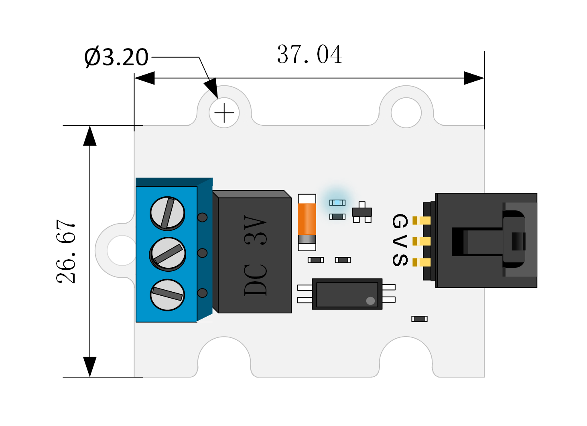
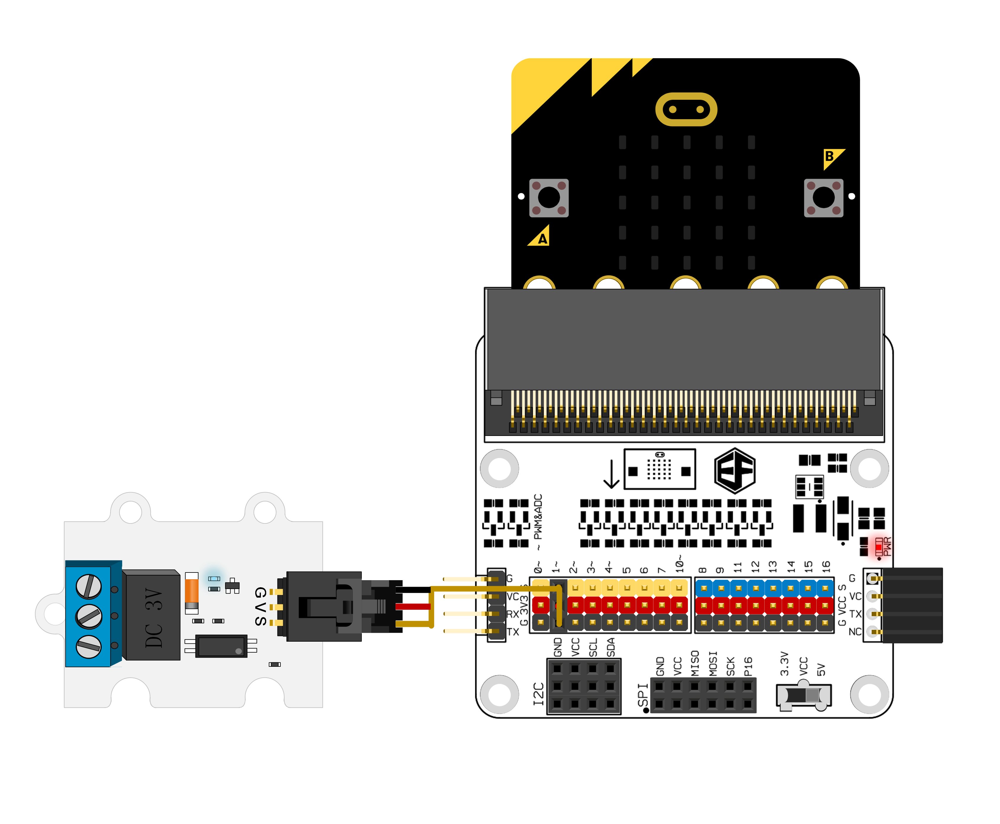
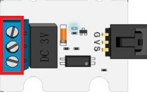

# 3V Relay Module(EF04086)

## Introduction
---

1 Channel Relay 3V Relay Module is one of OCTOPUS series of electric bricks. It is designed according to OCTOPUS electric brick series with same shape, PCB positioning holes and electric brick connectors. It has adopted a mini and high-quality HUIKE relay, which is available to control all kinds of home appliances and high current devices. This is a common accessory module for electronic DIY fans.

## Characteristics
---

- Equipped with a high current relay with max current can be up to 2A.
- Adopt 3V power supply.
- Contact control, including a normally open contact and a normally closed contact.
- Easy to connect wires.

## Parameter
---

Item | Parameter 
:-: | :-: 
Name|1 Channel Relay 3V Relay Module
Version|V1.0
SKU| EF04086
Working Voltage|DC 3~5.5V
Size|38x27mm
Contact Currency|DC 24V 2A，AC 120V 2A
NW|8.5g

## Outlook and Dimensions
---

## Quick to Start
---
### Hardware Connection

Connect the relay module to P1 on octopus:bit using a jumper cable. Insert micro:bit into the edge slot of octopus:bit.

While connecting the cables with the Relay, please use screwdrivers to loosen the screws on the Relay first to make sure the cables get connected properly. 

### Software Programming

Click to open [Makecode](https://makecode.microbit.org/), write your code in the editor area. Set high electric level to P1 port to make the normally open contact close and the normally closed contact open. Thus, we are able to control the connection of contact switch through code.
Links:[https://makecode.microbit.org/_Lvega7TP6ggz](https://makecode.microbit.org/_Lvega7TP6ggz)

You can also download the links below:

<iframe style="position:absolute;top:0;left:0;width:100%;height:100%;" src="https://makecode.microbit.org/#pub:_Lvega7TP6ggz" frameborder="0" sandbox="allow-popups allow-forms allow-scripts allow-same-origin"></iframe>
  

<iframe style="position:absolute;top:0;left:0;width:100%;height:100%;" src="https://makecode.microbit.org/#pub:_Lvega7TP6ggz" frameborder="0" sandbox="allow-popups allow-forms allow-scripts allow-same-origin"></iframe>

### Result 

The normally open contact is closed, while the normally closed contact is opened.

## FAQ
---
