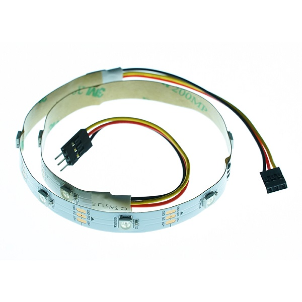
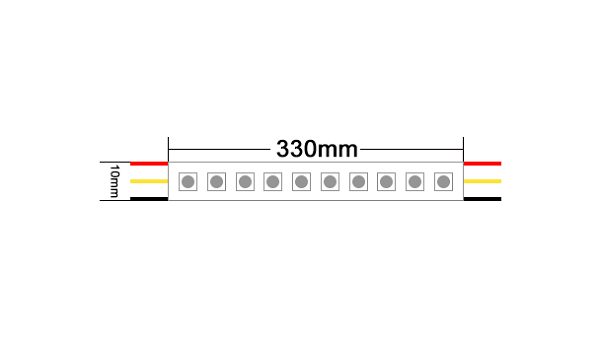
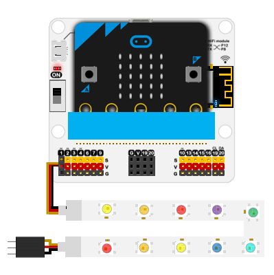
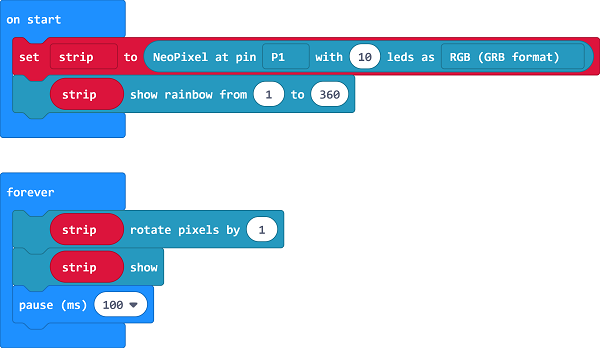

# Neopixel Rainbow LED Strip and GVS Connector -10 LEDs

## Introduction
---
- This is a colorful strip based on WS2812B beads, it can display the color of RGB and support multiple cascade at the same time.

 

## Characteristics
---

- Standard 3-pin GVS ports is easy to plug.
- Both ends are equipped with a connector and it supports multiple cascade.
- It can drive the micro:bit in 3.3V.

## Specifications
---

- SKU：EF04098
- Working Voltage: DC 3.0V
- Power Supply: 3v-5v
- Connector Type: Analog
- Number of beads: 10 pcs
- Pins Definition: 1-Signal 2-VCC 3-GND
- Response: Quick to response and high sensitivity
- Circuit：Simple drive circuit 
- Stability：Stable and durable

## Outlook and Dimensions
---

 

## Quick to Start
---
### Connection Diagram

- Connect to the P1 port of the extension board.

 

### Add Package
---
Click "Advanced" in MakeCode to check more choices.

 

Click "Extensions", and search "`neopixel`" in the dialogue box to download the codebase of LED beads.

### Programme as the Picture Shows
---
  

### Reference
---
Links: [https://makecode.microbit.org/_bfECLKegkYbR](https://makecode.microbit.org/_bfECLKegkYbR)

You can also download it directly: 

<iframe style="position:absolute;top:0;left:0;width:100%;height:100%;" src="https://makecode.microbit.org/#pub:_bfECLKegkYbR" frameborder="0" sandbox="allow-popups allow-forms allow-scripts allow-same-origin"></iframe>
  
---

### Results

- The LED strips light in a way of flowing-water.

## Relevant Cases
---

## Technique Files
---
