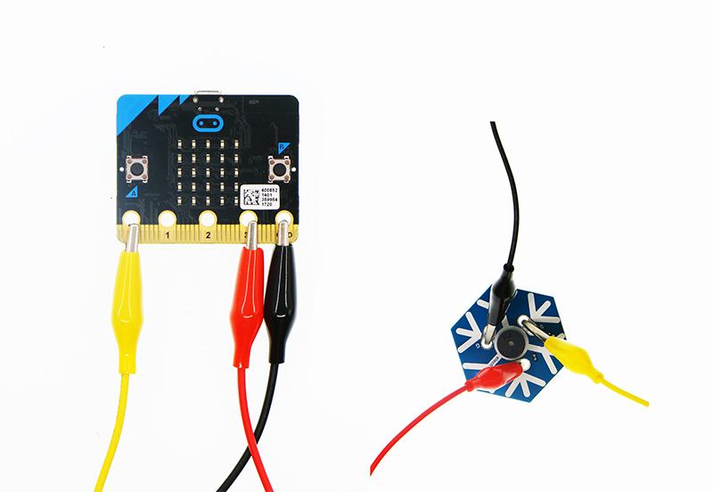
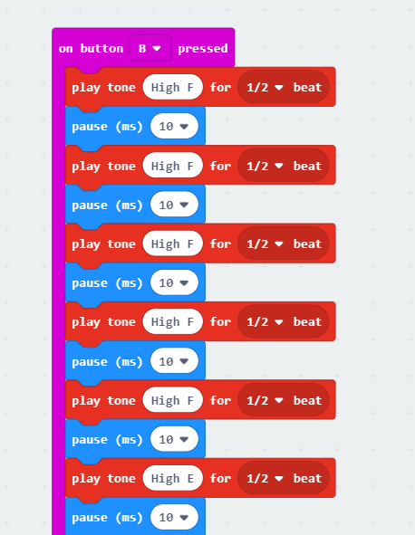

# Snowflake Buzzer for micro:bit

## Introduction
---
 The snowflake buzzer is a symbol of christmas day's snow. The snowflake buzzer is just like snow, comes in this christmas night and  play the christmas music.

## Features
---
- With crocodile clip lines, no need for a expansion board
- In snow shape, adapt to the christmas scene 
- Play the christmas music with coding

## Parameters 
---
|Items|Parameters|
|:-:|:-:|
|Name|Snowflake Buzzer|
|SKU| EF03419|
|Size|45.72mm Standard Hexagon|
|Net Weight|8.3g|

## Quick Start  
---
### Preparation
- 1 x Snowflake Buzzer
- 1 x micro:bit（Please prepare by yourself）
- 3 x crocodile clip lines（Please prepare by yourself）

### Hardware Connect  

- Connect the black crocodile clip line to the GND port of the micro:bit, the other side of the black crocodile clip line to the G port of the snowflake buzzer.
- Connect the red crocodile clip line to the 3V port of the micro:bit, the other side of the red crocodile clip line to the V port of the snowflake buzzer.
- Connect the yellow crocodile clip line to the 0 port of the micro:bit, the other side of the yellow crocodile clip line to the S port of the snowflake buzzer.

### Software  
#### Step 1

- Set "on button A pressed" and write a little bit of music(as below picture).

#### Step 2

- Set "on button B pressed" and write a little bit of music(as below picture).

### Program

Program link：[https://makecode.microbit.org/_W27acib6j8D3](https://makecode.microbit.org/_W27acib6j8D3)

You also could directly download program by visiting website as below:

<iframe style="position:absolute;top:0;left:0;width:100%;height:100%;" src="https://makecode.microbit.org/#pub:_W27acib6j8D3" frameborder="0" sandbox="allow-popups allow-forms allow-scripts allow-same-origin"></iframe>
  

### Result 

- When the button A pressed, a piece of "Jingle Bells" plays.
- When the button B pressed, a piece of "Jingle Bells" plays.

## FAQ

