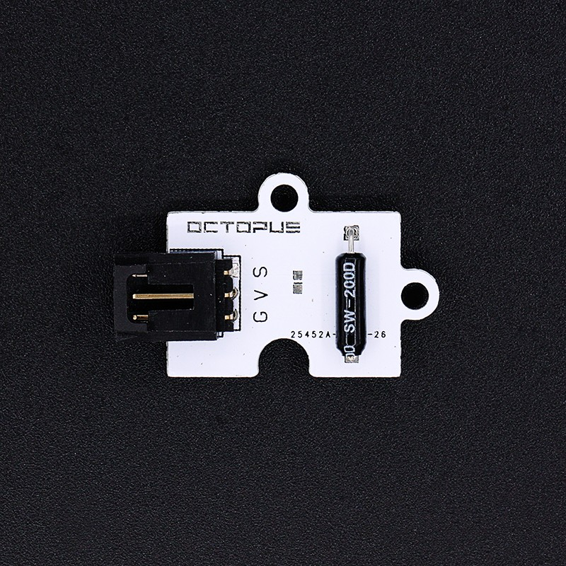
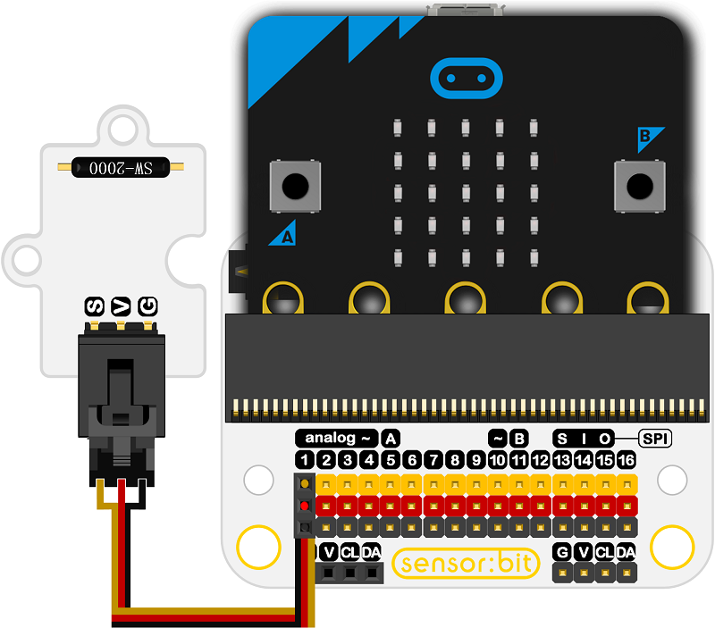
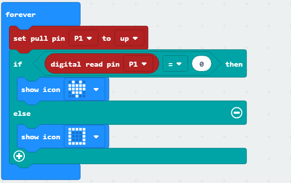

# Octopus Tilt Sensor(EF04001) 

## Introduction
---

- The Tilt sensor is to measure the  levelness of the object based on the tilt switch.
- 

## Characteristics
---

- The 3-pins ports is easy to plug and play.
- It can work with micro:bit in 3V. 

## Specifications
---

Item | Parameter 
:-: | :-: 
SKU|EF04001
Working Voltage|DC 3.0V
Power Input|3v-5v
Connector Type|Digital
Pins Definition|1-Signal 2-VCC 3-GND
Response|Quick to response with high sensitivity
Circuit|Simple
Stability|Stable and durable

## Outlook and Dimensions
---
 

## Quick to Start
---
### Connection diagram
- Connect to P1 port as the picture shows.

Take sensor:bit for example

 

Program as the picture shows

- Set the P1 port to a higher level to initialize the module.
- If the detected value is 0 and the the digital read pins is 0, the icon is shown on the screen.
- Or it shows a box.

 

### Reference

Links:https://makecode.microbit.org/_WMwRtRXFe2tw

You can also download it directly below:

<iframe style="position:absolute;top:0;left:0;width:100%;height:100%;" src="https://makecode.microbit.org/#pub:_WMwRtRXFe2tw" frameborder="0" sandbox="allow-popups allow-forms allow-scripts allow-same-origin"></iframe>
  

### Result
- When the tilt angel is changed,  the icon or rectangle is shown on the micro:bit.

## Relevant Cases 
---

## Technique Files
---
