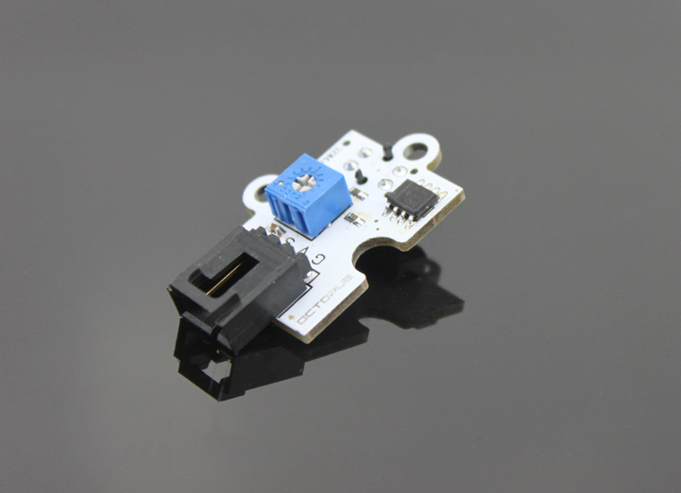
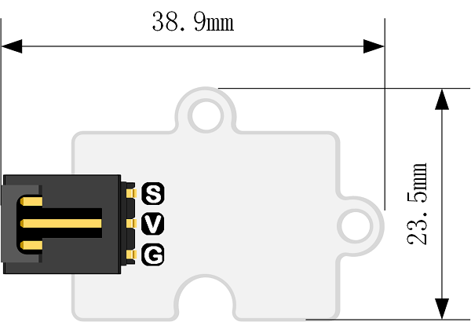
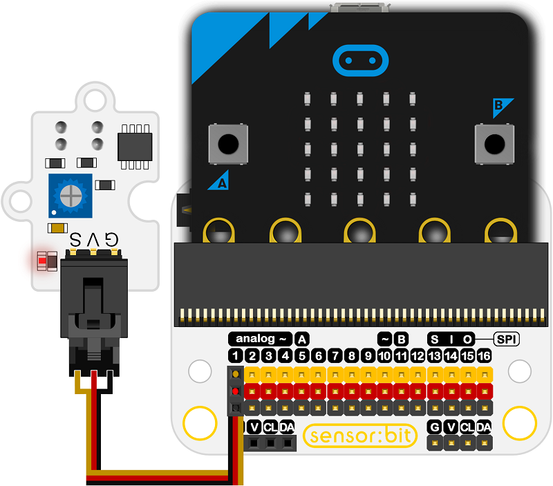
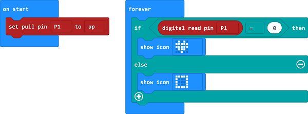

# Octopus Hunt Sensor(EF04002) 

## Introduction
---
- Octopus Hunt Sensor is a sensor based on TCRT5000 photoelectric sensitive element.It can sensitively detect the infrared reflected signal. 

 

##  Characteristics
---

- The 3-pins ports is easy to plug and play.
- It can work with micro:bit in 3V. 

## Specifications
---

Item | Parameter 
:-: | :-: 
SKU|EF04002
Power Input|3V-5V
Connector Type|Digital
Pins Definition|1-Signal 2-VCC 3-GND
Response|Quick response with high sensitivity
Circuit|Simple
Stability|Stable and durable

## Outlook and Dimensions
---

 

## Quick to Start
---
### Materials used and connection diagram
Connect to the P1 port as the picture shows

Take sensor:bit for example

 

Program as the picture shows

- Set the P1 port to a higher level to initialize the module.
- If any object is detected, the value is 0 and the the digital read pins is 0, the icon is shown on the screen.
- Or it shows a box.

 

### Reference

Links: https://makecode.microbit.org/_2vF4fKc5rdoP

You can also download it directly below:

<iframe style="position:absolute;top:0;left:0;width:100%;height:100%;" src="https://makecode.microbit.org/#pub:_2vF4fKc5rdoP" frameborder="0" sandbox="allow-popups allow-forms allow-scripts allow-same-origin"></iframe>
  

### Result

- If put 9mm away from the black objects,it shows an icon; while 9mm away from the white objects, it shows a box.

## Relevant Cases
---

## Technique Files
---
