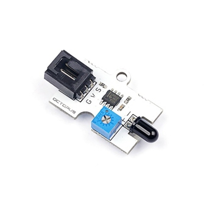

# Octopus Flame Sensor(EF04003)

## Introduction

 It can be used to detect the source of fire.

## Products Link

[ELECFREAKS Octopus Flame Sensor](https://www.elecfreaks.com/octopus-flame-sensor.html)

## Characteristics

 Standard 3-pin GVS port is easy to plug. 
 Support driving micro:bit in 3V.

## Specifications

Item | Parameter 
:-: | :-: 
SKU|EF04003
Power Supply|3V-5.5V
Connections Type|Digital
Pins Definition|1-Signal 2-VCC 3-GND
     Response     | Quick response with high sensitivity 
     Circuit      |                Simple                
    Stability     |          Stable and durable          

## Outlook and Dimensions

## Quick to Start 

### Materials Required and Connection Diagram

### Programme as the picture shows
 It shows different icons according to the value detected from the Flame Sensor. If no source of fire being detected, the returned value is 0 and it shows a smile; or it shows other icons. 

### Reference

Link：[https://makecode.microbit.org/_cYsWq7LR9Y7s](https://makecode.microbit.org/_cYsWq7LR9Y7s)
You can also download it below directly:

<iframe style="position:absolute;top:0;left:0;width:100%;height:100%;" src="https://makecode.microbit.org/#pub:_cYsWq7LR9Y7s" frameborder="0" sandbox="allow-popups allow-forms allow-scripts allow-same-origin"></iframe>
  

### Result
 If no source of fire being detected, it shows a smile; or it shows other icons. 

## Relevant Cases

## Technique Files

