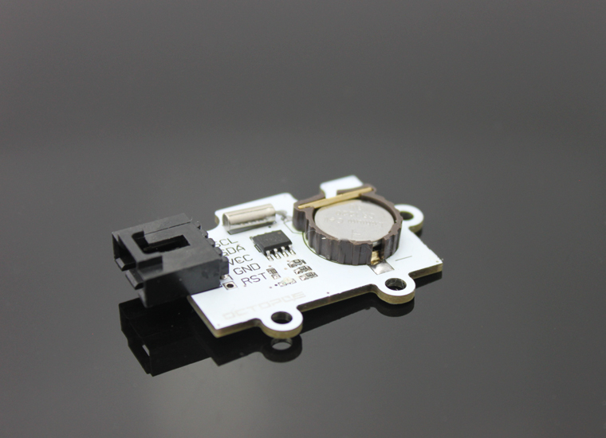
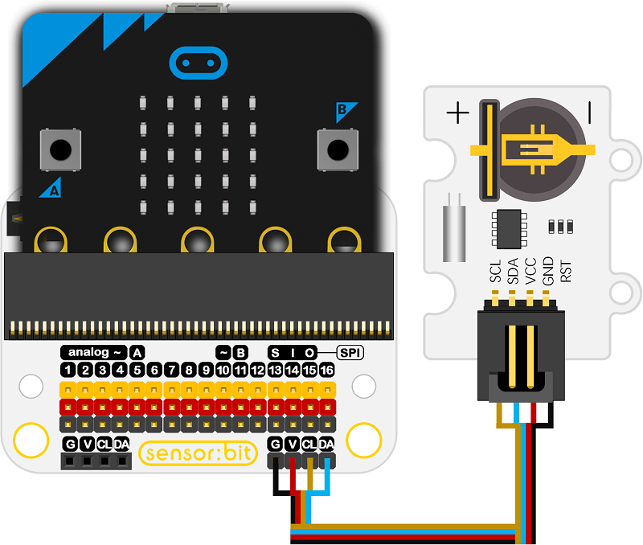
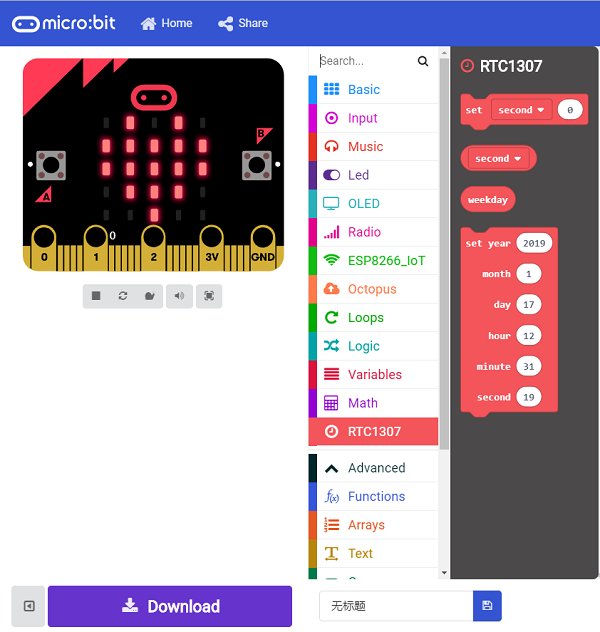

# Octopus Real-time Clock(EF04005)

## Introduction
---
- OCTOPUS Real-time Clock is a clock module which can achieve counting for year, month, day, hour by using the DS1307 clock chip.

 

## Characteristics
---

- The chip works in a low voltage equipped with 56-byte non-volatile RAM clock calendar
- It has a complete BCD code real-time clock chip, address and data are passed through two-wire bidirectional serial bus, providing information such as seconds, minutes, hours, etc., and can automatically adjust the number of days per month.
- It can automatically set the time of the leap year.
- The chip has built-in power checking circuit that can check the power lost condition and switch the battery.

## Specifications
---

Item | Parameter 
:-: | :-: 
SKU|EF04005
Connector|Two-wire serial interface (IIC Communication)
Output|Programmable SQW
Detection|Automatic power failure detection and switching circuit
Power dissipation|In the standby battery mode, the power consumption is less than 500nA
Working temperature|-40℃ ~80℃
Power input|3v-5v
Connector type|Digital
Pins Definition|1-GND 2-VCC 3-SCK 4-SDA 5-RST

## Quick to  Start 
---

### Materials used and the connection diagram

- Connect to IIC port as the picture shows
- SCL pin needs to connect to SDA pin. 

Take sensor:bit for example

 

### Add Package

- Click "Advanced"in the choice of the MakeCode to find more choices.

 

- Click "Extensions", search "iot"in the dialog box and then download it.

 

 

### Program as the picture shows

- Set the number of second as "10" on start to show the second each minute.

 

### Reference

[https://makecode.microbit.org/_4AgTERW0qXRt](https://makecode.microbit.org/_4AgTERW0qXRt)

You can also download the links below:

<iframe style="position:absolute;top:0;left:0;width:100%;height:100%;" src="https://makecode.microbit.org/#pub:_4AgTERW0qXRt" frameborder="0" sandbox="allow-popups allow-forms allow-scripts allow-same-origin"></iframe>
  

### Result

- The current number of second is shown on the micro:bit each minute.

## Relevant Cases
---

## Technique Files
---
