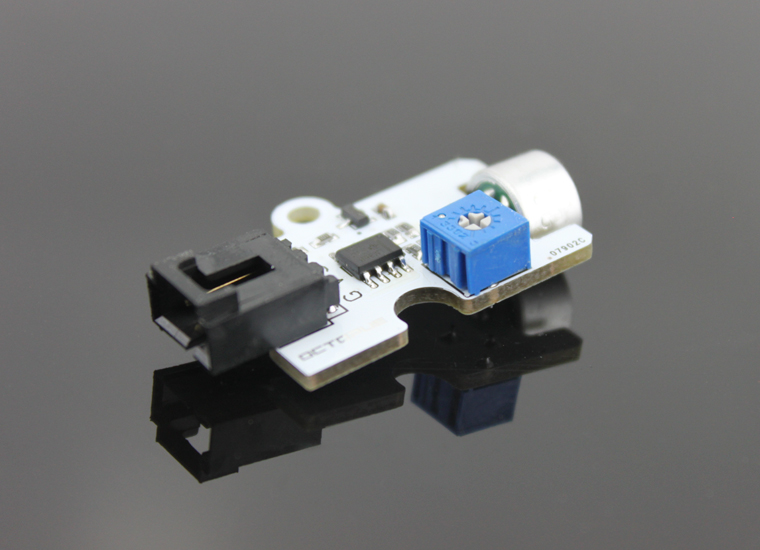
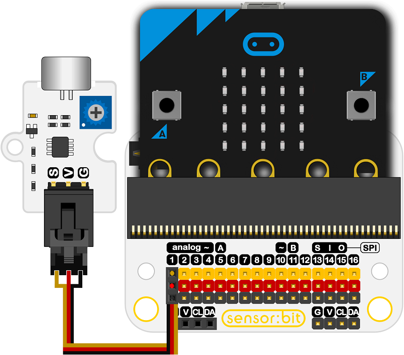

# Octopus Sound Sensor 

## Introduction
---

- OCTOPUS Sound Sensor is a sensor module based on MIC sound sensing element. Sound Sensor is particularly sensitive to sound intensity,and it can be used to detect ambient sound level, but it can not identify the size of sound and the specific sound frequencies. It is available to make voice switches and other works.

 

## Characteristics
---
- The 3-pins ports is easy to plug and play.
- It can work with micro:bit in 3V. 

## Specifications
---
Item | Parameter 
:-: | :-: 
SKU|EF04008
Power Input|3V-5.5V
Connector Type|Analog
Pins Definition|1-Signal 2-VCC 3-GND
Response|Quick response with high sensitivity
Circuit|Simple
Stability|Stable and durable

## Outlook and Dimensions
---
 

## Quick to Start
---

### Materials used and connection diagram
- Connect to the P1 port as the picture shows

  Take sensor:bit for example

 

### Add Package
- Click "Advanced"in the choice of the MakeCode to find more choices.

 

- Click "Extensions", search "iot"in the dialog box and then download it.

 

 

### Program as the picture shows
- Show the current noise(dB)

 

### Reference
Links:https://makecode.microbit.org/_TzgHwu4jUAdy 

You can also download the links below:

<iframe style="position:absolute;top:0;left:0;width:100%;height:100%;" src="https://makecode.microbit.org/#pub:_TzgHwu4jUAdy" frameborder="0" sandbox="allow-popups allow-forms allow-scripts allow-same-origin"></iframe>
  
---

### Result
- The value of the current noise(dB) is shown on the micro:bit. 

## Relevant Cases
---

## Technique Files
---
