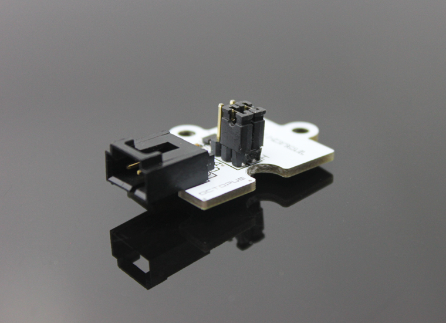
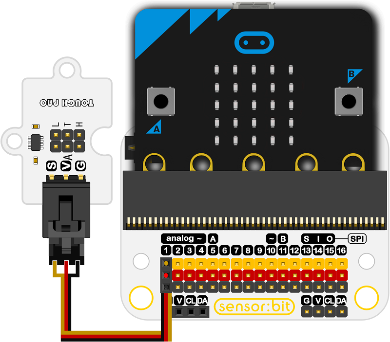

# Octopus Touch PAD Sensor 

## Introduction

Touch PAD Brick is a sensor module mainly through the capacitive touch TTP223-BA6 charge IC and the body of pressure, ceramics, glass and other dielectric materials, and the charge level is used to detect small changes in a touch switch of a sensor module.

 

## Characteristics
---
- The 3-pins ports is easy to plug and play.

## Specifications
---
Item | Parameter 
:-: | :-: 
SKU|EF04011
Working Voltage|2.0V~5.5V
Anti-interference|Stable operation is ensured under strong external disturbances
Sensibility|Sensitivity can be externally adjusted through 0~50pF CS capacitor
Choice Model|Two choices
Output Mode|Two Choices
High and low output mode|Can be selected(AHLB pins)
Insulation characteristics|Insulating medium between 0MM~10MM
## Outlook and Dimensions
---
 

## Quick to Start
---

### Materials used and connection diagram
1 x micro：bit

1 x sensor：bit

1 x Touch PAD Brick

Connect to the P1 port.

 
### Add Package
Click "Advanced"in the choice of the MakeCode to find more choices.

 

Click "Extensions", search "iot"in the dialog box and then download it.
 

### Program as the picture shows
 

### Reference
links:
[https://makecode.microbit.org/_UJELf0aERP9z](https://makecode.microbit.org/_UJELf0aERP9z)
You can also download the links below:

<iframe style="position:absolute;top:0;left:0;width:100%;height:100%;" src="https://makecode.microbit.org/#pub:_UJELf0aERP9z" frameborder="0" sandbox="allow-popups allow-forms allow-scripts allow-same-origin"></iframe>
  
---

### Result
- The relevant information is shown on the micro:bit.

## Relevant cases
---

## Technique Files
---
