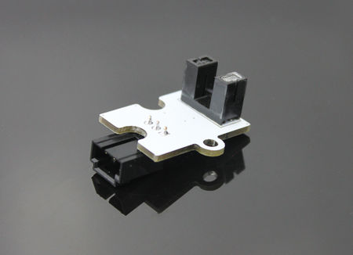
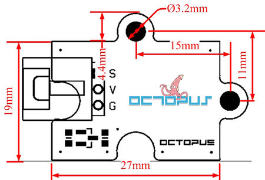
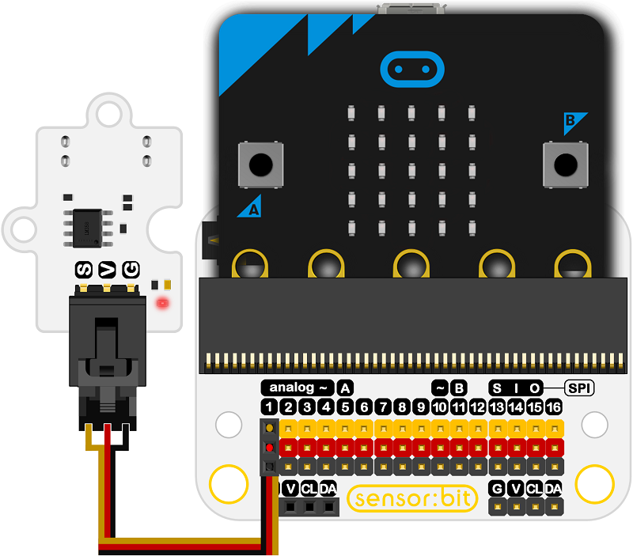
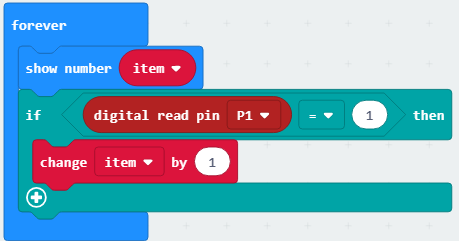

# Octopus Photo Interrupter Sensor(EF04012) 

## Introduction

 Photo Interrupter Sensor is a sensor module based on ITR9608 photoelectric switch that can be used with micro:bit.

   

## Characteristics

 The 3-pins ports is easy to plug and play.
 It can work with micro:bit in 3V. 

## Specifications

Item | Parameter 
:-: | :-: 
SKU|EF04012
ITR9608 Optoelectronic switch|Built-in infrared transmitter and receiver tube
LED with signal|Signal Indicator
Working Voltage|DC 3.0V-5.0V
Connector Type|Digital
Pins Definition|1-Signal 2-VCC 3-GND
Response|Quick to response with high sensitivity
Stability|Stable and durable

## Outlook and Dimensions

 

## Quick to Start

### Connection diagram
 Connect to P1 port as the picture shows.

Take sensor:bit for example

 

### Program as the picture shows
 Show the value variable.
 Add 1 on the value variable each time when the Photo Interrupter Sensor detects a value.

### Reference

Links: https://makecode.microbit.org/_VcJWCh4hw97j

You can also download it directly below:

<iframe style="position:absolute;top:0;left:0;width:100%;height:100%;" src="https://makecode.microbit.org/#pub:_VcJWCh4hw97j" frameborder="0" sandbox="allow-popups allow-forms allow-scripts allow-same-origin"></iframe>
  

### Result
 The on start micro:bit shows number 0, the counting system would add one each time when objects are put on the Optoelectronic switch.

## Relevant Cases 

## Technique Files

