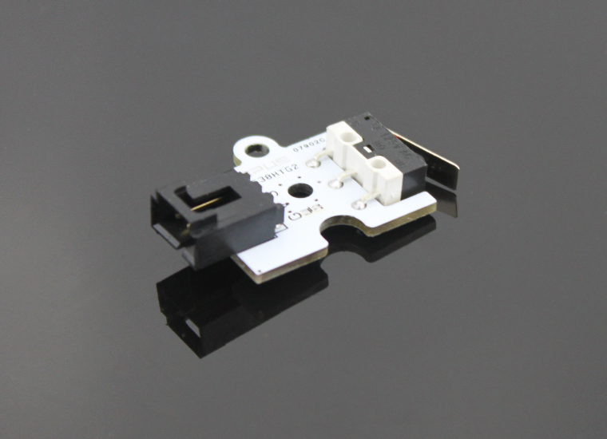
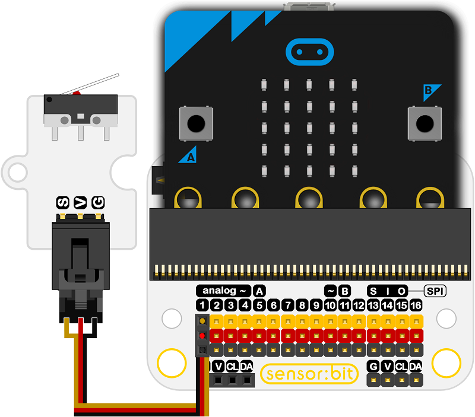
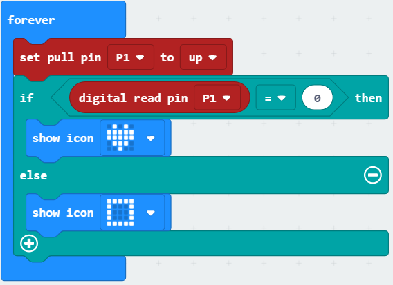

# Octopus Crash Sensor Brick(EF04013)

## Introduction

 Crash Sensor Brick is a sensor module based on crash switch, simple circuit design, high sensitivity.

 

## Products Link

[ELECFREAKS Octopus Crash Sensor](https://shop.elecfreaks.com/products/elecfreaks-octopus-crash-sensor?_pos=1&_sid=60f4b6135&_ss=r)

## Characteristics

 The 3-pins ports is easy to plug and play.

  It can work with micro:bit in 3V. 

## Specifications

Item | Parameter 
:-: | :-:  
SKU|EF04013
Working Voltage|3.3-5V
   Connector Type    |Digital
Pins Definition|1-Signal 2-VCC 3-GND
Response|Quick to response with high sensitivity
Power Dissipation|ULP
Working Temperature|-20-70℃
Circuit|Simple
Stability|Stable and durable
## Outlook and Dimensions

 

## Quick to Start

### Connection diagram
 Connect to P1 port as the picture shows.

Take sensor:bit for example

 

### Quick to Start
 Set the P1 port to a higher level to initialize the module.
 After being pressed, the returned value is 0,  the digital read P1 pin is  0, then the icon is shown on the screen.
 Or it shows a box.

 

### Reference
Links: https://makecode.microbit.org/_WMwRtRXFe2tw

You can also download it directly below:

<iframe style="position:absolute;top:0;left:0;width:100%;height:100%;" src="https://makecode.microbit.org/#pub:_WMwRtRXFe2tw" frameborder="0" sandbox="allow-popups allow-forms allow-scripts allow-same-origin"></iframe>
  

### Result

When the sensor is pressed, a rectangle is showing on the micro:bit; while released, an icon is showing on the micro:bit.

## Relevant Cases 

## Technique Files

