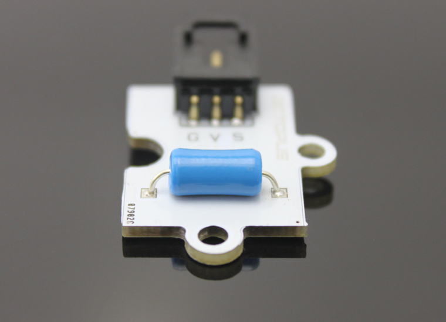
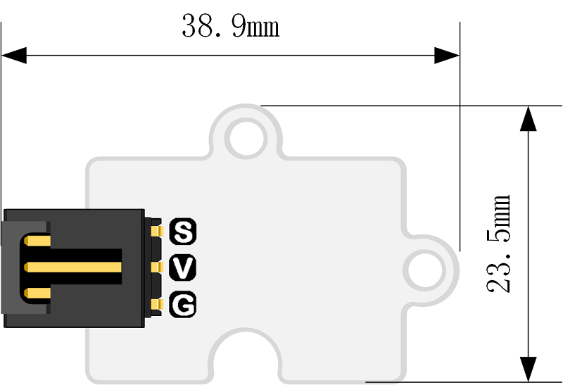
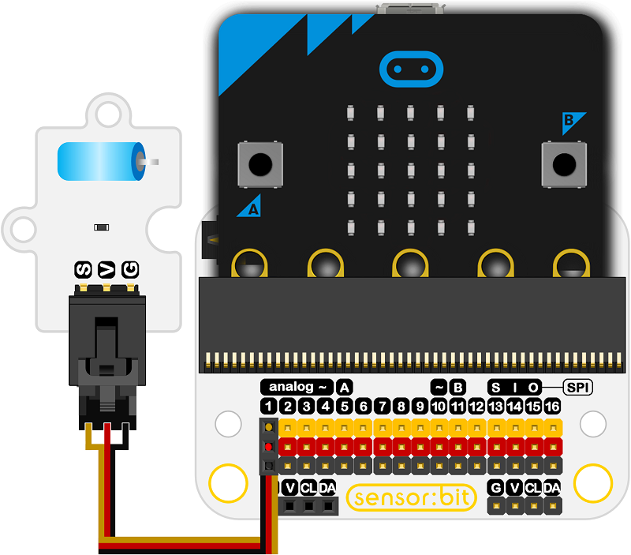

# Octopus Vibration Sensor(EF04014) 

## Introduction

 Vibration Sensor Brick is a module based on vibration trigger switch. 

 

## Products Link

[ELECFREAKS Octopus Vibration Sensor](https://shop.elecfreaks.com/products/elecfreaks-octopus-vibration-sensor?_pos=1&_sid=e0d3be877&_ss=r)

## Characteristics

  When in the stationary state, the indicator LED is OFF. When subjected to external vibration touch to achieve the appropriate vibration force, or move away from the speed of the appropriate (partial) effort, conductive pin will produce an instant turn-on (ON) state. At that time, electrical characteristics have changed. While if the external force disappear, electrical characteristics will restore OFF state.

## Specifications

Item | Parameter 
:-: | :-:  
SKU|EF04014
Working Voltage|3V-5V
Connection Mode|G-GND，V-VCC，S(test the signal)
Pins Definition|V-VCC G-GND S-D3
Circuit|Simple
Function|Achieve fun and interactive courses

## Outlook and Dimensions

 

## Quick to Start

### Connection diagram
 Connect to P1 port as the picture shows.

Take sensor:bit for example

 

### Program as the picture shows
 Show the returned value through P1 pin.

 

### Refaerence
Links:
[https://makecode.microbit.org/_32DD3C4Lv33u](https://makecode.microbit.org/_32DD3C4Lv33u)
You can also download it directly below:

<iframe style="position:absolute;top:0;left:0;width:100%;height:100%;" src="https://makecode.microbit.org/#pub:_32DD3C4Lv33u" frameborder="0" sandbox="allow-popups allow-forms allow-scripts allow-same-origin"></iframe>
  

 While vibrating, it shows 1 on the micro:bit, or it shows 0.

## Relevant Cases 

## Technique Files

