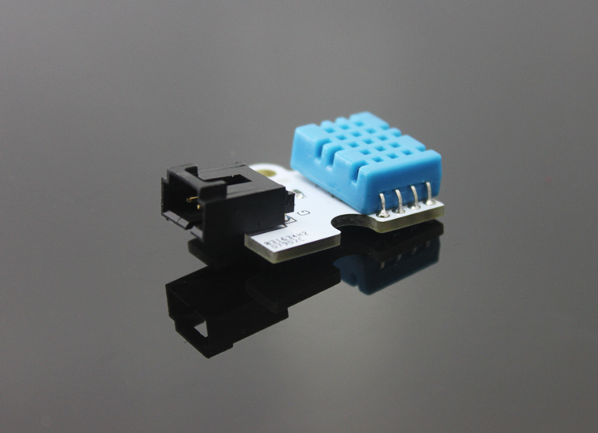
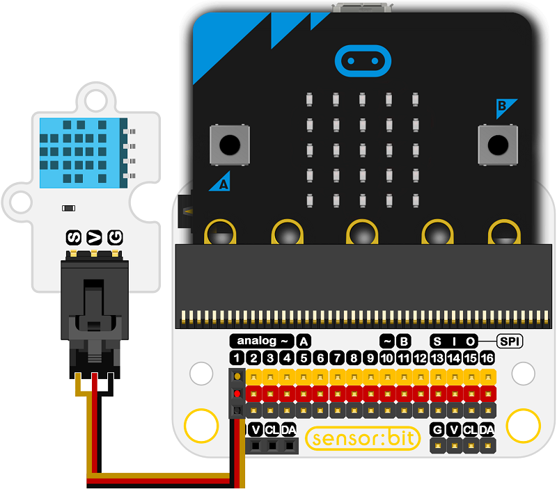

# Octopus Temperature And Humidity Sensor(EF04019) 

## Introduction
---
- Temperature and humidity sensor is a module based on DHT11 digital temperature and humidity sensing element. It is sensitive to the ambient temperature and humidity changes and can be used for temperature alarm, humidity testing and other works.

 

## Characteristics
---
The 3-pins ports is easy to plug and play.

## Specifications
---

Item  | Parameter 
:-: | :-: 
SKU|EF04019
Power Input|3v-5.5v
Connector Type|Analog
Pins Definition|1-Signal 2-VCC 3-GND
Response|Quick response
Sensitivity|High
circuit|Simple
Service Life|Long(Stable and durable)

## Outlook and Dimensions
---

 

## Quick to Start
---

### Connection diagram
- Connect to P1 port as the picture shows.

Take sensor:bit for example

 

### Add Package
- Click "Advanced"in the choice of the MakeCode to find more choices.

 

- Click "Extensions", search "iot"in the dialog box and then download the "iot-environment-kit".

 

### Program as the picture shows
- The current temperature value is showing on the micro:bit.

 

### Reference
Links: [https://makecode.microbit.org/_E2kTxL2wp42J](https://makecode.microbit.org/_E2kTxL2wp42J)

You can also download the links below:

<iframe style="position:absolute;top:0;left:0;width:100%;height:100%;" src="https://makecode.microbit.org/#pub:_E2kTxL2wp42J" frameborder="0" sandbox="allow-popups allow-forms allow-scripts allow-same-origin"></iframe>
  

### Result
- The temperature value is scrolling on the micro:bit.

## Relevant Cases
--

## Technique Files
--
