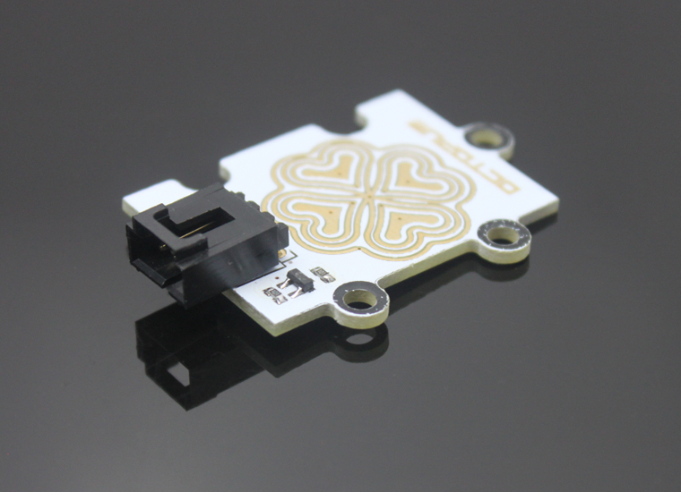
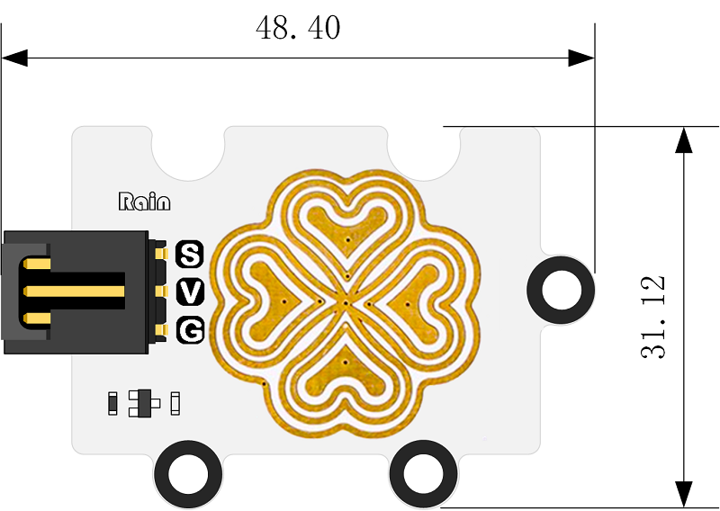
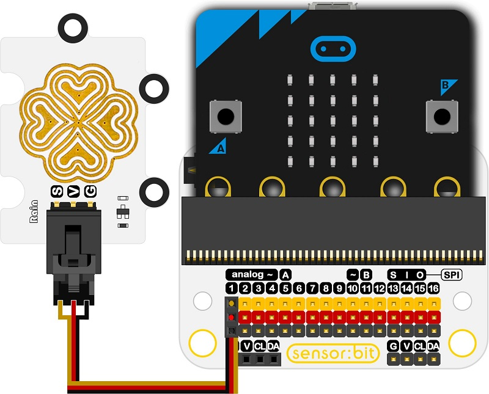

# Octopus Rain/Steam Sensor

## Introduction
---

This is a Rain/steam sensor from ElecFreaks, the output voltage will increase when the humidity of the sensor surface goes up, thus to detect the change of the humidity.

 

## Characteristics
---
- The 3-pins ports is easy to plug and play.
- It can work with micro:bit in 3V. 

## Specifications
---
Item |              Parameter               
:-: | :-: 
SKU|EF04024
Power Input|3V-5.5V
Connector Type|Analog
Pins Definition|1-Signal 2-VCC 3-GND
Response|Quick response with high sensitivity
Circuit|Simple
Stablity|Stable and durable

## Outlook and Dimensions
---

 

## Quick to Start
---
### Materials used and connection diagram
- Connect to the P1 port as the picture shows

Take sensor:bit for example

 

### Program as the picture shows:
- Analog read to P1 port and show the value on the micro:bit.

 

### Reference
Links:
[https://makecode.microbit.org/_7cm75DbwJEaY](https://makecode.microbit.org/_7cm75DbwJEaY)
You can also download the links below:

<iframe style="position:absolute;top:0;left:0;width:100%;height:100%;" src="https://makecode.microbit.org/#pub:_7cm75DbwJEaY" frameborder="0" sandbox="allow-popups allow-forms allow-scripts allow-same-origin"></iframe>
  
---

### Result
- The current amount of precipitation is scrolling on the micro:bit. 

## Relevant Cases
---

## Technique Files
---
