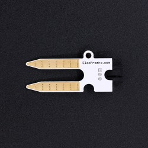
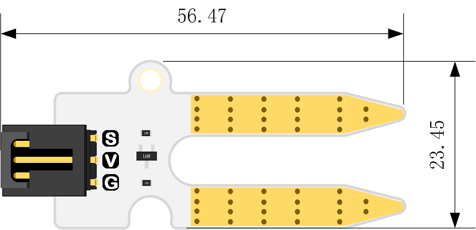
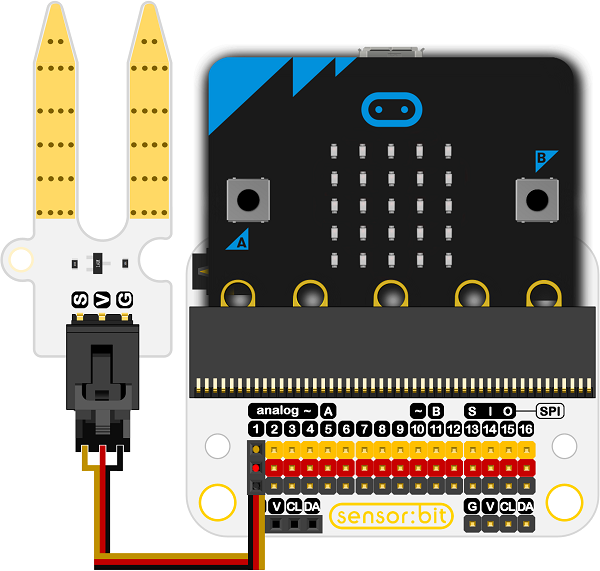
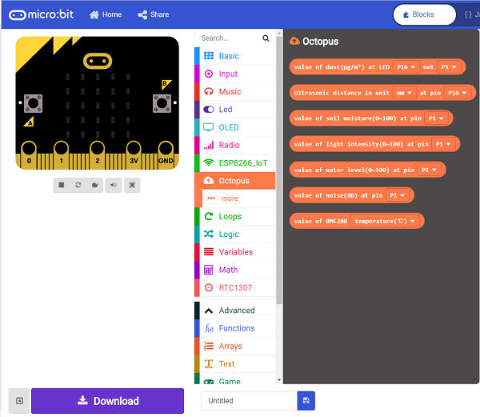

# Octopus Soil Moisture Sensor Brick(EF04027) 

## Introduction

 Octopus Soil Moisture Sensor Brick can read the amount of moisture present in the soil surrounding it.

 

## Products Link

[ELECFREAKS Octopus Soil Moisture Sensor](https://shop.elecfreaks.com/products/elecfreaks-octopus-soil-moisture-sensor?_pos=1&_sid=c9bb26e20&_ss=r)

## Characteristics

 The 3-pins ports is easy to plug and play.
 It can work with micro:bit in 3V. 

## Specifications

Item |  Parameter               
:-: | :-: 
SKU|EF04027
Power Input|3V-5.5V
 Connector Type  |Analog
Pins Definition|1-Signal 2-VCC 3-GND
Response|Quick response with high sensitivity
Circuit|Simple
Stability|Stable and durable

## Outlook and Dimensions

 

## Quick to Start

### Materials used and connection diagram
 Connect to the P1 port as the picture shows

  Take sensor:bit for example

 

 ### Add Package

  Click "Advanced"in the choice of the MakeCode to find more choices.

 

 Click "Extensions", search "iot"in the dialog box and then download it.

 

 

### Program as the picture shows
 The soil moisture is showing on the micro:bit circularly.

 

### Reference
Links: [https://makecode.microbit.org/_X3xXFcTkMUex](https://makecode.microbit.org/_X3xXFcTkMUex)
You can also download the links below:

<iframe style="position:absolute;top:0;left:0;width:100%;height:100%;" src="https://makecode.microbit.org/#pub:_X3xXFcTkMUex" frameborder="0" sandbox="allow-popups allow-forms allow-scripts allow-same-origin"></iframe>
  

### Result
 The soil moisture is showing on the micro:bit after inserting the module into the soil.

## Relevant Cases

## Technique Files

