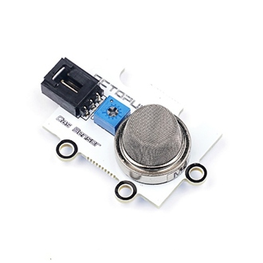
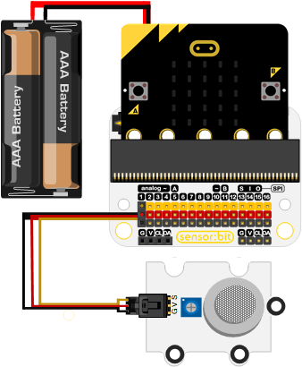
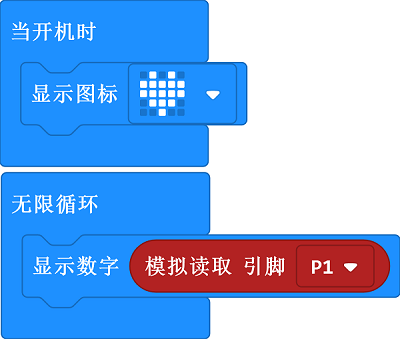

# MQ2 Analog Gas Sensor Brick

## Introduction
 The analog gas sensor - MQ2 is used in gas leakage detecting equipments in consumer and industry markets, this sensor is suitable for detecting LPG, i-butane, propane, methane ,alcohol, hydrogen, smoke. It is of high sensitivity and fast response, the sensitivity can be adjusted by the potentiometer.

## Characteristics 
---
- Standard 3-pin GVS port is easy to plug. 
## Specification
---

Item | Parameter 
:-: | :-: 
SKU|EF04028
Connections Type|Analog
Pins Definition|S-Sigal V-VCC G-GND
Working Voltage|5V
Size|38x27mm

Size：

## Outlook and Dimension
---

## Quick to Start 
---

### Materials required and connections diagram 
---

- Connect to P1 port as the picture shows. 

***Take sensor:bit for example***

### Program as the picture shows 

### Reference
Link：[https://makecode.microbit.org/_KJVXj9Co2UXU](https://makecode.microbit.org/_KJVXj9Co2UXU)

You can also download it directly below:

<iframe style="position:absolute;top:0;left:0;width:100%;height:100%;" src="https://makecode.microbit.org/#pub:_KJVXj9Co2UXU" frameborder="0" sandbox="allow-popups allow-forms allow-scripts allow-same-origin"></iframe>
  
---

### Result
- Preheat it for 10 minutes after connections, detect the smoke by approaching the probes to the smoke while the returned value is almost stable. 
- With the change of the smoke, the returned value gets bigger with the growing of the smoke concentration.
## Relevant Cases
---

## Technical File
---
