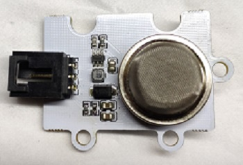

# MQ5 Analog Gas Sensor Brick(EF04029)

## Introduction

MQ-5 Gas sensor has a good sense to liquefied gas, natural gas and coal gas that are widely used in cities, but it doesn't work on ethanol or smoke. 

## Products Link

[ELECFREAKS Octopus Smoke Sensor MQ-5 Brick](https://www.elecfreaks.com/octopus-gas-sensor-mq-5-brick-obmq5.html)

## Characteristics

 Standard 3-pin GVS port is easy to plug. 
## Specification

Item | Parameter 
:-: | :-: 
SKU|EF04029
Connections Type|Analog
Pins Definition|S-Sigal V-VCC G-GND
Working Voltage|3V
Size|38x27mm

## Outlook and Dimension

## Quick to Start

### Materials required and connections diagram 

 Connect to P1 port as the picture shows. 

***Take sensor:bit for example***

### Program as the picture shows 

### Reference
Link：[https://makecode.microbit.org/_KJVXj9Co2UXU](https://makecode.microbit.org/_KJVXj9Co2UXU)

You can also download it directly below:

<iframe style="position:absolute;top:0;left:0;width:100%;height:100%;" src="https://makecode.microbit.org/#pub:_KJVXj9Co2UXU" frameborder="0" sandbox="allow-popups allow-forms allow-scripts allow-same-origin"></iframe>
  

### Result
 Preheat it for 3 minutes after connections, detect the gas by approaching the probes to the gas while the returned value is almost stable. 
 With the change of the Carbon Monoxide's concentration, the returned value gets bigger with the growing of it.
## Revelent Case

## Technical File

