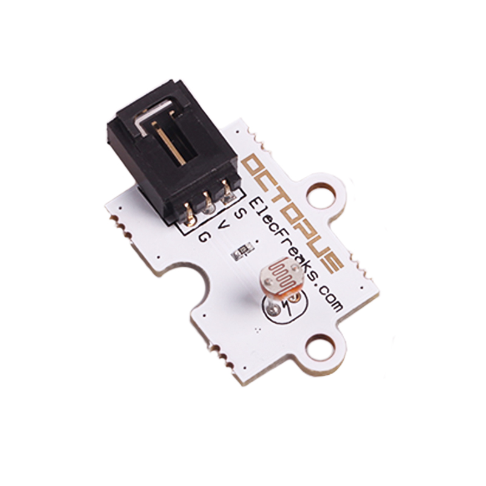
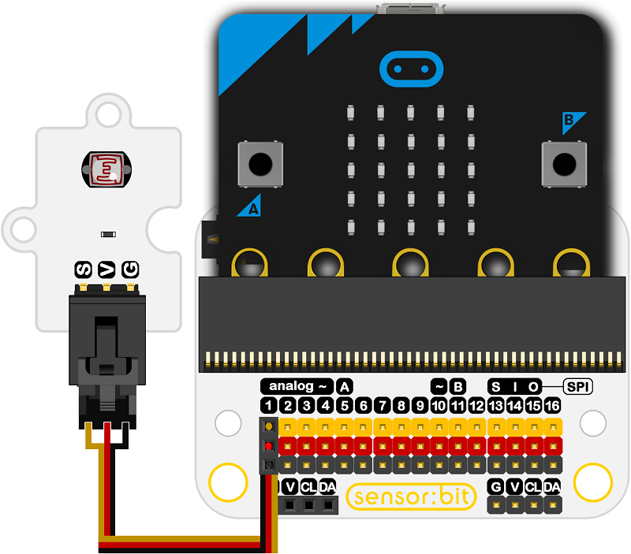
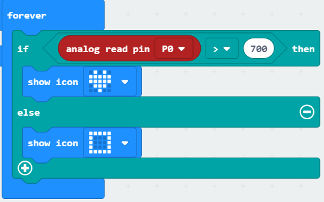

# Octopus Analog Photocell Brick OBPhotocell(EF04032) 

## Introduction

Photocells are sensors that allow you to detect light. They are small, inexpensive, low-power, easy to use and don't wear out. For that reason they often appear in toys, gadgets and appliances. 

 

## Products Link

[ELECFREAKS Octopus Analog Photocell Brick](https://shop.elecfreaks.com/products/elecfreaks-octopus-analog-photocell-brick?_pos=1&_sid=0eb81c422&_ss=r)

## Characteristics

 Photocells are basically a resistor that changes its resistive value (in ohms Ω) 
 They have a low cost which is also friendly to the environment.
 Each photocell sensor will act a little differently than the other, even if they are from the same batch.
  For this reason, they shouldn't be used to try to determine precise light levels in lux or millicandela. Instead, you can expect to only be able to determine basic light changes.
 The 3-pins ports is easy to plug and play.

## Specifications

Item | Parameter 
:-: | :-: 
SKU|EF04032
Power Supply|3V-5.5V
Connector Type|Analog
Pins Definition|1-Signal 2-VCC 3-GND
Response|Quick response with high sensitivity
Circuit|Simple
Stability|Stable and durable

## Outlook and Dimensions

 

## Quick to Start

### Materials used and connection diagram

 Connect to the P1 port as the picture shows

  Take sensor:bit for example

 

### Program as the picture shows

 

### Reference

Links: [https://makecode.microbit.org/_XsgKbLhb54MP](https://makecode.microbit.org/_XsgKbLhb54MP)

You can also download the links below:

<iframe style="position:absolute;top:0;left:0;width:100%;height:100%;" src="https://makecode.microbit.org/#pub:_XsgKbLhb54MP" frameborder="0" sandbox="allow-popups allow-forms allow-scripts allow-same-origin"></iframe>
  

### Result
 While the light intensity is over 700, an icon is showing on the micro:bit; or a rectangle is showing on the micro:bit.
## Relevant Cases

## Technique Files

