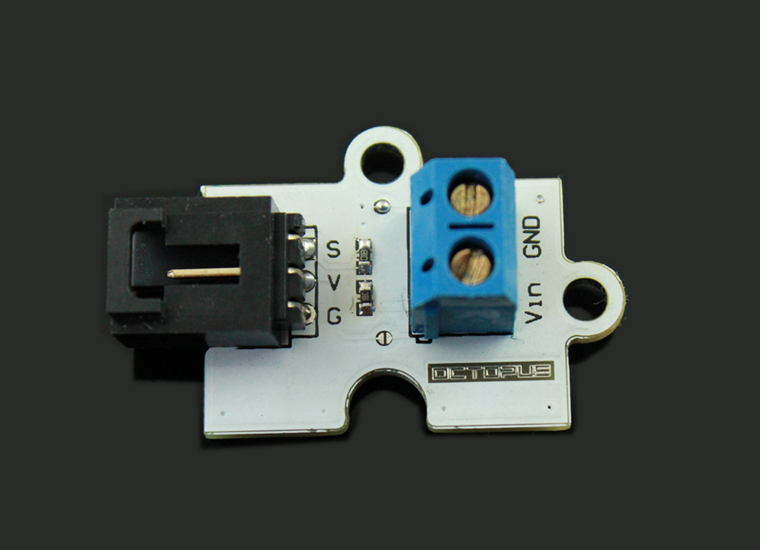
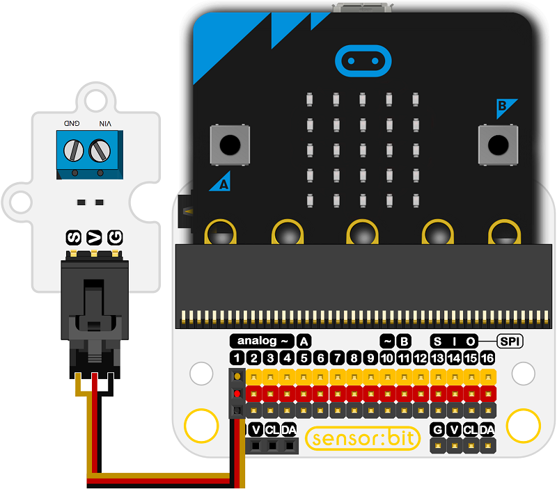

# Octopus Analog Voltage Divider Brick OBVoltage 

## Introduction
---
The Voltage Divider can detect the supply voltage upto 50V and  is based on resistor(1K and 15K Precision resistors).

 

## Characteristics
- The voltage detection module allows the input voltage to reduce 16 times. As the micro:bit analog input voltage is 3.3V, so voltage detection module's input voltage can not be greater than the 3.3Vx16 = 52.8V. Because of the micro:bit's 10 bit ADC, that means sampling resolution are 0.003225V（3.3V / 1023）.So the module's minimum input voltage is 0.00489Vx3.3=0.01064V.   
- Tips: All of Octopus bricks have supported Scratch programming. 

## Specifications
---
Item | Parameter 
:-: | :-: 
SKU|EF04039
Type|Analog
Input Voltage（DC）|Utmost: 50V，Lowest: 0.01064V
Detection Scope|Upto 50V

## Outlook and Dimensions
---
 

## Quick to Start
---
### Materials used and connection diagram

- Connect to the P1 port as the picture shows

  Take sensor:bit for example

 

### Add Package

### Program as the picture shows

 

### Reference
Links: [https://makecode.microbit.org/_AXD2gM3J36Jz](https://makecode.microbit.org/_AXD2gM3J36Jz)

You can also download the links below:

<iframe style="position:absolute;top:0;left:0;width:100%;height:100%;" src="https://makecode.microbit.org/#pub:_AXD2gM3J36Jz" frameborder="0" sandbox="allow-popups allow-forms allow-scripts allow-same-origin"></iframe>
  
---

### Result
- The current voltage is showing on the micro:bit.
## Relevant Cases
---

## Technique Files
---
