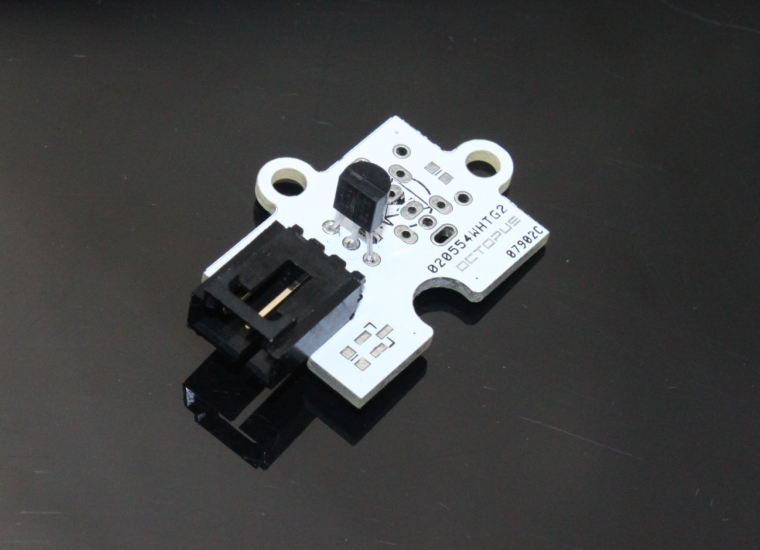
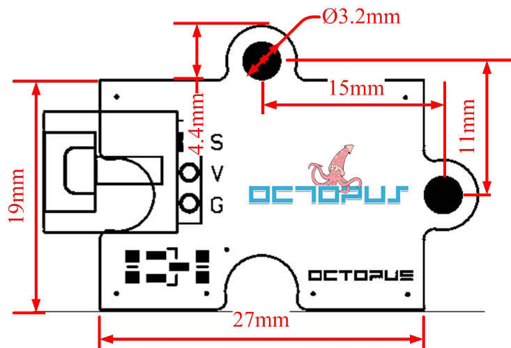
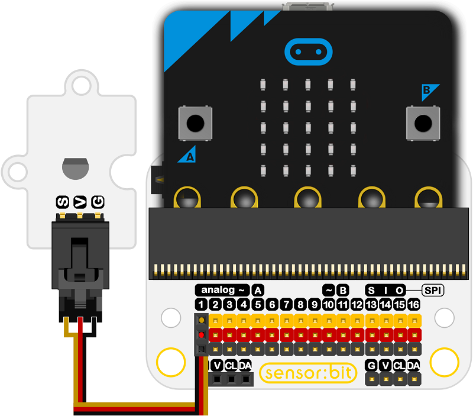

# Octopus DS18B20 Digital Temperature Brick(EF04042) 

## Introduction

This brick uses the DS18B20 1-Wire digital temperature sensor from Maxim IC.

 

## Products Link

[ELECFREAKS Octopus DS18B20 Digital Temperature Brick](https://shop.elecfreaks.com/products/elecfreaks-octopus-ds18b20-digital-temperature-brick?_pos=1&_sid=34036b630&_ss=r)

## Characteristics

 It can report degrees C with 9 to 12-bit precision, -55C to 125C (+/-0.5C). Each sensor has a unique 64-Bit Serial number etched into it that can allow for a huge number of sensors to be used on one data bus. 

## Specifications

Item | Parameter 
:-: | :-: 
SKU|EF04042
Power Dissipation|ULP
Working Temperature|-20-70℃
Working Voltage|3.3-5V

## Outlook and Dimensions

 

## Quick to Start

### Materials used and connection diagram

Take sensor:bit for example

 

### Add Package

 Click "Advanced"in the choice of the MakeCode to find more choices.

 

Click "Extensions", search "iot"in the dialog box and then download it.

 

### Program as the picture shows

 

### Reference

Links: [https://makecode.microbit.org/_FEiCtaV235Xw](https://makecode.microbit.org/_FEiCtaV235Xw)

You can also download the links below:

<iframe style="position:absolute;top:0;left:0;width:100%;height:100%;" src="https://makecode.microbit.org/#pub:_FEiCtaV235Xw" frameborder="0" sandbox="allow-popups allow-forms allow-scripts allow-same-origin"></iframe>
  

### Result
 The current temperature is showing on the micro:bit.

## Relevant Cases

## Technique Files

