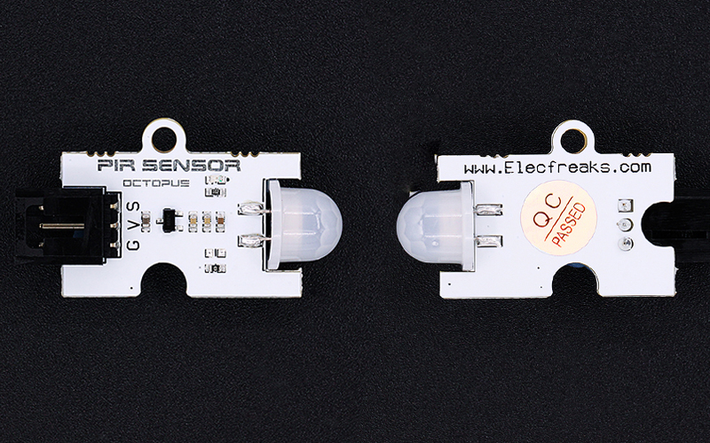
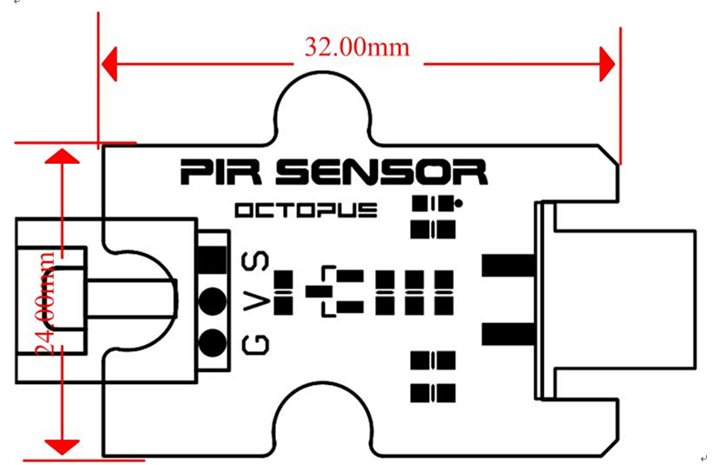
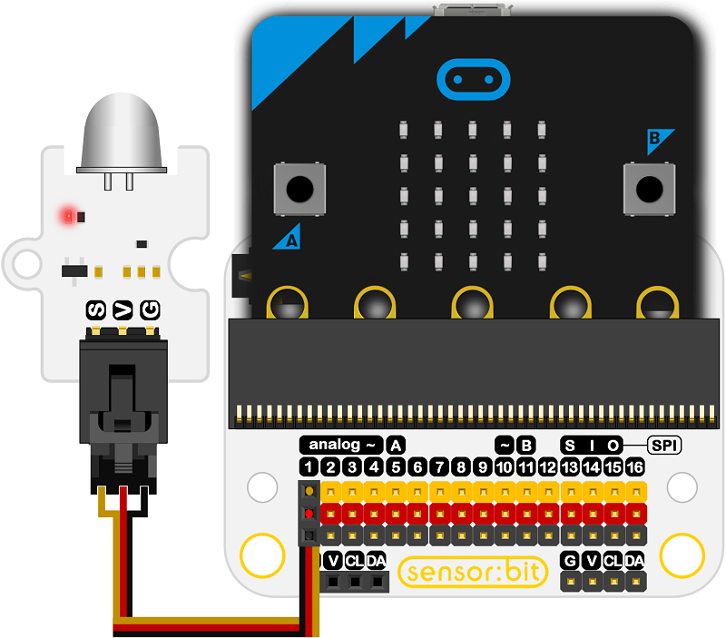
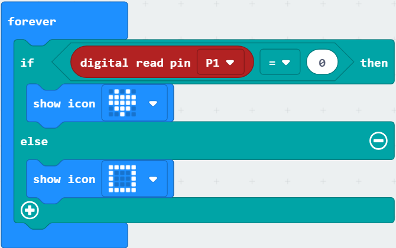

# Octopus PIR Sensor Brick(EF04055)

## Introduction
---
OCTOPUS PIR Sensor module is a type of electronic building block based on AM412 pyroelectric digital smart sensor. It can be used in sensing and detection of human or animal motion, sensing distance is about 4-5 meters.

 

## Characteristics
---
- The 3-pins ports is easy to plug and play.

## Specifications
---

Item | Parameter 
:-: | :-: 
SKU|EF04055
Power Supply|3.3V~5.5V
DSP|SP
Dissipation|Adjustable power
Input|Bi-directional differential and high resistance
Anti-interference|Built-in filter to shield other Hz
Power Source|Excellent PSR, RF makes little influence to Schmidt REL
Voltage Stability|low voltage and dissipation, the voltage is stable after giving power
Working Temperature|-25~85℃
Size|32.00mm×24.00mm

## Outlook and Dimensions
---

 

## Quick to Start
---

### Materials used and connection diagram

- Connect to the P1 port as the picture shows

  Take sensor:bit for example

### Add Package

### Program as the picture shows

1. Digital read pin P1.
2. While the show number is 0, an icon is showing on the micro:bit.
3. While the show number is 1, a rectangle is showing on the micro:bit.

 

### Reference

Links:[https://makecode.microbit.org/_esoRoUPzUAhf](https://makecode.microbit.org/_esoRoUPzUAhf)

You can also download the links below:

<iframe style="position:absolute;top:0;left:0;width:100%;height:100%;" src="https://makecode.microbit.org/#pub:_esoRoUPzUAhf" frameborder="0" sandbox="allow-popups allow-forms allow-scripts allow-same-origin"></iframe>
  

### Result
- If there is object approaching, an icon is showing on the micro:bit; while taking away the object, a rectangle is showing on the micro:bit.

## Relevant Cases
---

## Technique Files
---
