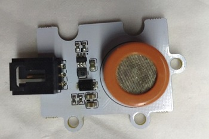
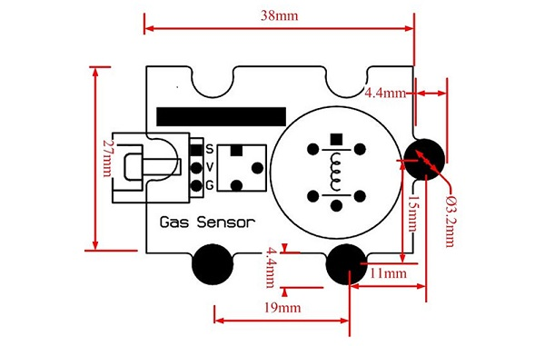
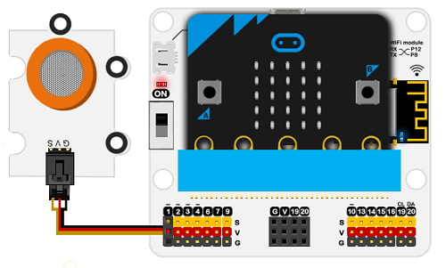

# MQ3 Gas Sensor Brick(EF04060)

## Introduction
---
The gas sensitive material used in the MQ-3 gas sensor is tin dioxide (SnO2), which has a low conductivity in clean air. While the sensor being put in an environment that exists the alcohol vapor, the electrical conductivity of the sensor increases as the concentration of alcohol gas in the air increases.

## Characteristics
---
- Standard 3-pin GVS port is easy to plug. 

## Specification
---

Item | Parameter 
:-: | :-: 
SKU|EF04060
Connections Type|Analog
Pins Definition|S-Sigal V-VCC G-GND
Working Voltage|3V
Size|38x27mm

Size：

## Outlook and Dimension
---

## Quick to Start
---

### Materials required and connections diagram 

- Connect to P1 port as the picture shows. 

***Take iot:bit for example***

***Note：*** Due to the high power consumption, powering with the USB wires from the breakout board(you can use our IoT:bit or Wukong breakout board) is required. 

### Program as the picture shows 

### Reference
Link：[https://makecode.microbit.org/_KJVXj9Co2UXU](https://makecode.microbit.org/_KJVXj9Co2UXU)

You can also download it directly below:

<iframe style="position:absolute;top:0;left:0;width:100%;height:100%;" src="https://makecode.microbit.org/#pub:_KJVXj9Co2UXU" frameborder="0" sandbox="allow-popups allow-forms allow-scripts allow-same-origin"></iframe>
  

### Result
- Preheat it for 3 minutes after connections, detect the alcohol gas by approaching the probes to the gas while the returned value is almost stable.
- With the change of the alcohol gas's concentration, the returned value gets bigger with the growing of it.

## Revelent Case
---

## Technical File
---
