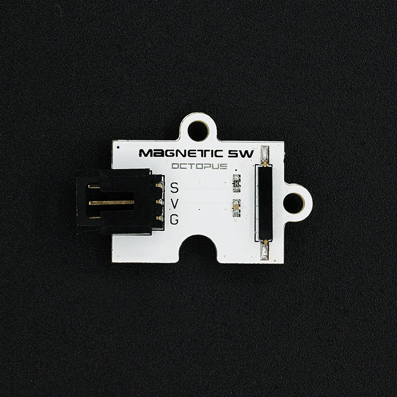
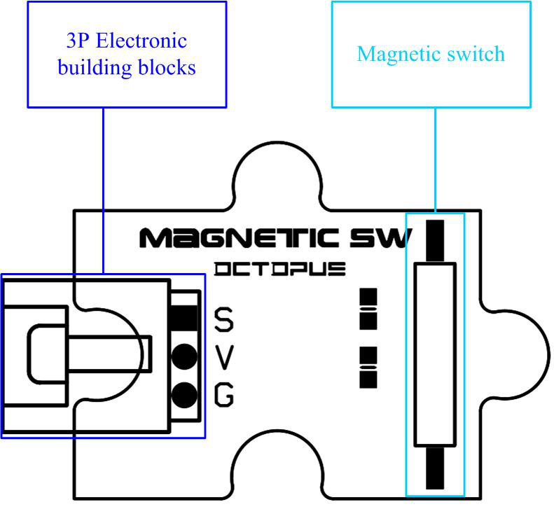
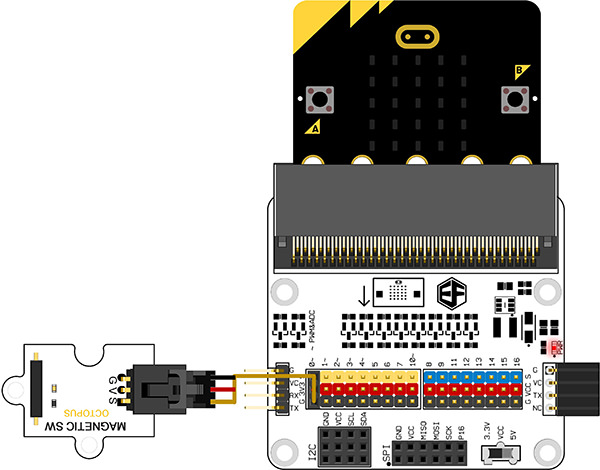
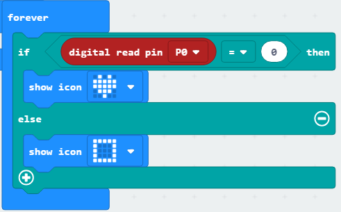

# Octopus Magnetic Switch

## Introduction
---
OCTOPUS Magnetic Switch is a simple electric brick module with magnetic control switch.It is normally combined with electromagnet or components with magnet.It can be used to security alarming system，door magnetic switch and so on.

 

## Characteristics
---
- The 3-pins ports is easy to plug and play.

## Specifications
---
Item | Parameter 
:-: | :-: 
SKU|EF04075
Working Voltage|3.3-5V
Weight|5g
Mode of Motion|Swift, small volume
Touch Points|Strong corrosion and abrasion resistance
Working Current|200mA
Working Temperature|-55~125℃
Size|23.48mm×31.28mm

## Outlook and Dimensions
---
 

## Quick to Start

### Materials used and connection diagram

- Connect to the P0 port 

  Take sensor:bit for example

### Add Package

### Program as the picture shows

### Reference

Links:[https://makecode.microbit.org/_9qEAW758A6Cm](https://makecode.microbit.org/_9qEAW758A6Cm)

You can also download the links below:

<iframe style="position:absolute;top:0;left:0;width:100%;height:100%;" src="https://makecode.microbit.org/#pub:_9qEAW758A6Cm" frameborder="0" sandbox="allow-popups allow-forms allow-scripts allow-same-origin"></iframe>
  
---

### Result
- When there is magnet approaching, a rectangle is showing on the micro:bit; Or an icon is showing on the micro:bit.

## Relevant Cases

------

## Technique Files

---
