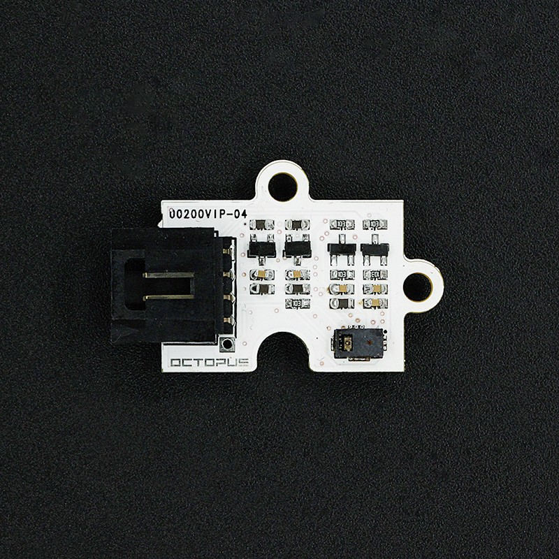
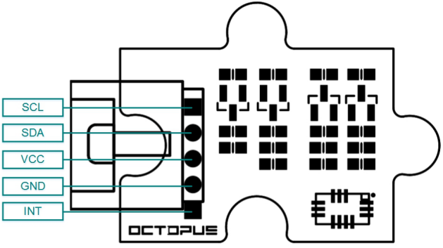
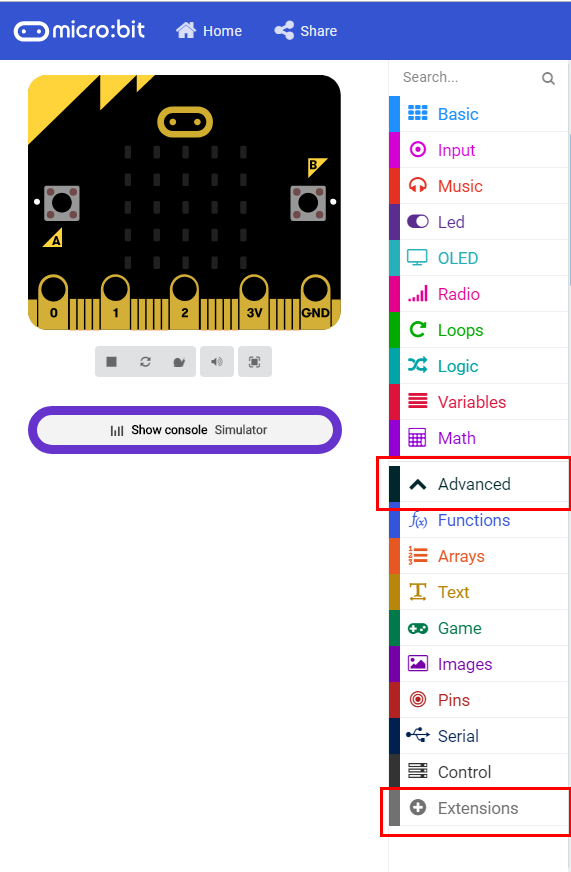
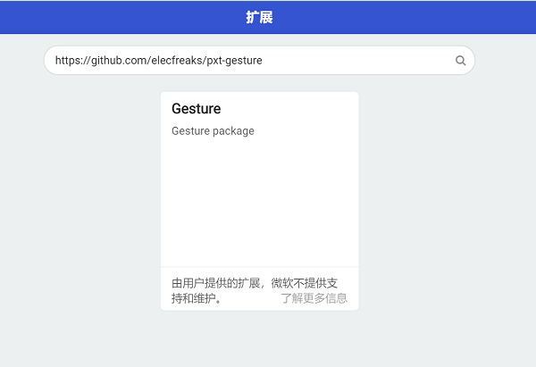
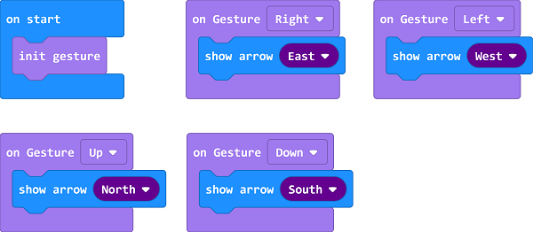
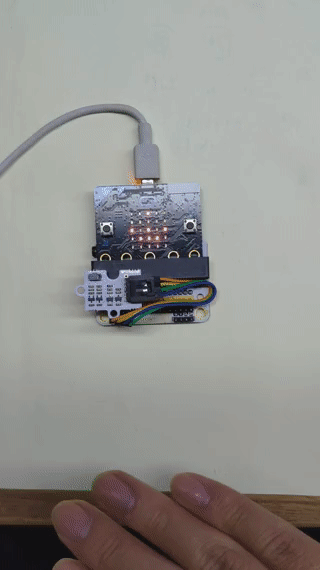

# OCTOPUS Gesture Sensor PAJ7620U2

## Introduction
---
OCTOPUS Gesture Sensor is PAJ7620U2 that integrates gesture recognition function with general I2C interface into a single chip. It can recognize 9 gestures including move up, move down, move left, move right, etc with a simple swipe of your hand.

 

- ## Characteristics

  ------

  The 3-pins ports is easy to plug and play.

## Specifications
---
Item | Parameter 
:-: | :-: 
SKU|EF04078
Detection Method|Built-in approaching detection device
Gesture|9基本手势(上/下/右/左/前进/后退/顺时针/顺时针/波计数）9 gestures including move up/down/left/right/forward/back/clockwise/anticlockwise/pulse counter
Detection Scope|5-10cm
Ability for Anti-background light|100k
Power Supply|5V
Working Temperature|-20℃~70℃
Size|23.48mm×31.28mm

## Outlook and Dimensions
---

 

## Quick to Start
---
### Materials used and connection diagram

Take sensor:bit for example

### Add Package

Click "Advanced"in the choice of the MakeCode to find more choices.

Click "Extensions", search "oled"in the dialog box and then download the "oled-ssd1306".

### Program as the picture shows

### Reference
Links:[https://makecode.microbit.org/_Dry9Rm7xpi2A](https://makecode.microbit.org/_Dry9Rm7xpi2A)

You can also download the links below:

<iframe style="position:absolute;top:0;left:0;width:100%;height:100%;" src="https://makecode.microbit.org/#pub:_Dry9Rm7xpi2A" frameborder="0" sandbox="allow-popups allow-forms allow-scripts allow-same-origin"></iframe>
  
---

### Result
- Different data is showing on the micro:bit with the different gestures.

## Relevant Cases

------

## Technique Files

---
