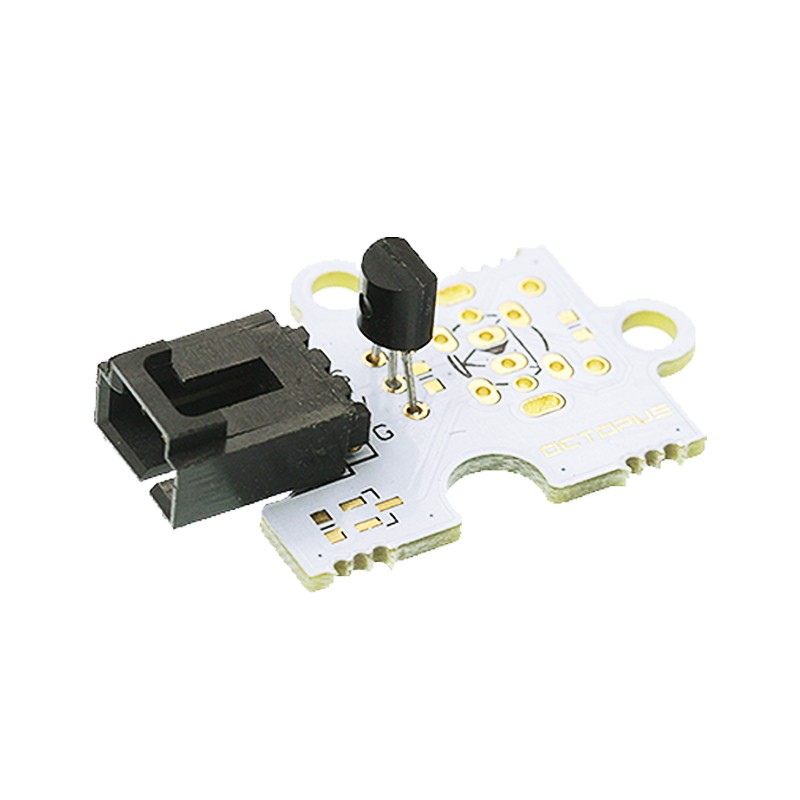
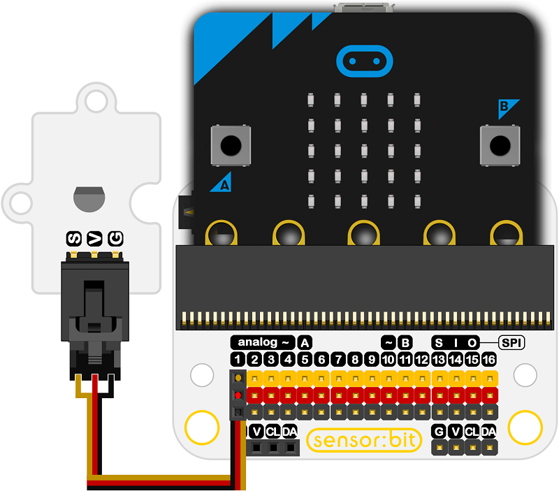
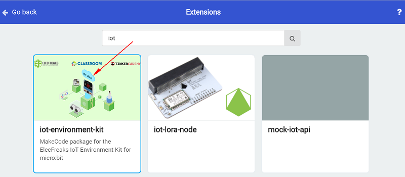

# Octopus Temperature Sensor Brick TMP36(EF04079)

## Introduction
---
Octopus TMP36 Temperature Sensor Brick is a temperature sensor with low voltage and accurate Celsius read. It can provide voltage output,which forms a linear relationship with Celsius temperature.

 

## Characteristics
---

The 3-pins ports is easy to plug and play.

## Specifications
---

Item | Parameter 
:-: | :-: 
SKU|EF04079
Accuracy|±2°C(Typical value)
Linearity|±0.5°C（Typical value）
            Working Voltage            |2.7V~5.5V
         Thermal Effect Index          |When power currency lower than 50 μA
Nominated Temperature Measuring Range|-40 °C to +125 °C, working temperature can be up to +150 °C.
Ratio Coefficient|+ 10 mV /°C
Static Current|Below 50μA
Turn Off Current|Max 0.5μA

## Outlook and Dimensions
---

 

## Quick to Start
---

### Materials used and connection diagram

Connect to the P1 port 

Take sensor:bit for example

 

### Add Package

Click "Advanced"in the choice of the MakeCode to find more choices.

 

Click "Extensions", search "iot"in the dialog box and then download it.

 

### Program as the picture shows
1. Choose the display brick for the micro:bit.
2. Choose the function of showing the temperature from the IoT package.
3. The temperature is showing on the micro:bit.

 

### Reference

Links:[https://makecode.microbit.org/_URRdVrPFX68R](https://makecode.microbit.org/_URRdVrPFX68R)

You can also download the links below:

<iframe style="position:absolute;top:0;left:0;width:100%;height:100%;" src="https://makecode.microbit.org/#pub:_URRdVrPFX68R" frameborder="0" sandbox="allow-popups allow-forms allow-scripts allow-same-origin"></iframe>
  

### Result
- The current temperature is showing on the micro:bit.

## Relevant Cases
---

## Technique Files
---
