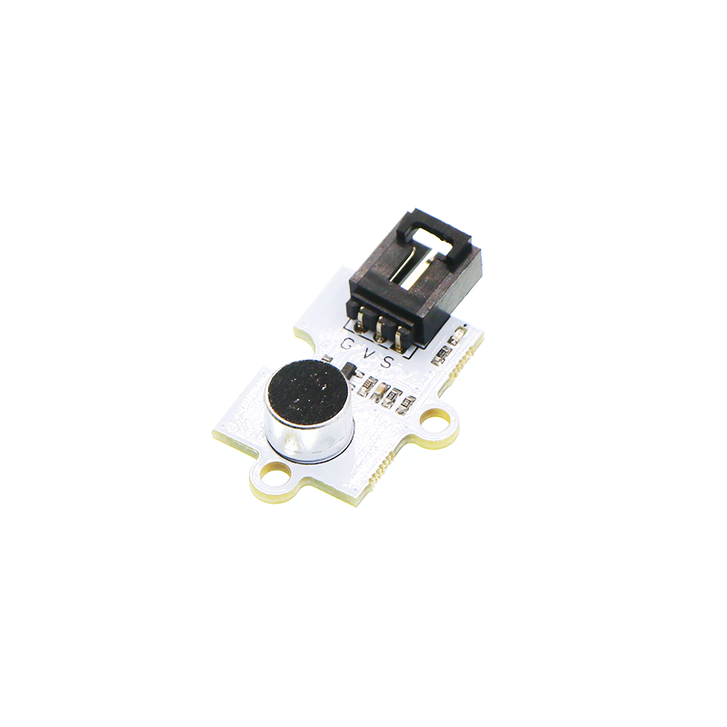
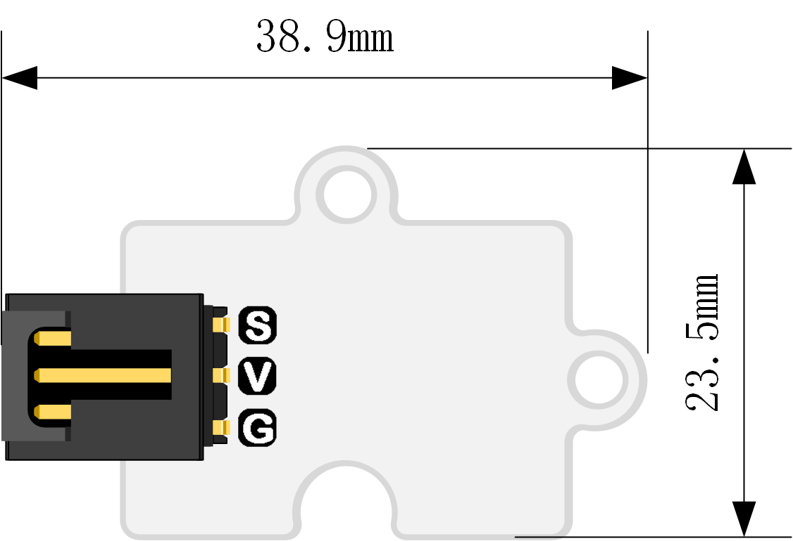
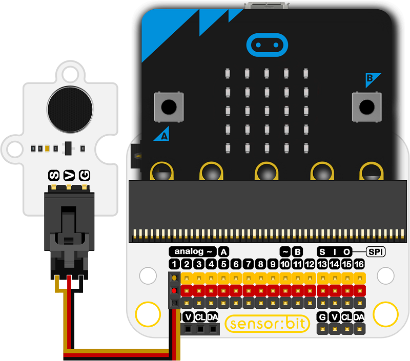

# Octopus Analog Noise Sound Sensor Detection Module 

## Introduction
---
Octopus Analog Noise Sound Sensor Detection Module  is particularly sensitive to sound intensity, and it can be used to detect ambient sound level.

 

- ## Characteristics

  ------

  The 3-pins ports is easy to plug and play.

## Specifications
---
Item | Parameter 
:-: | :-: 
SKU|EF04081
Output Voltage|3.3V-5V
Sine Wave|Loud noise brings greater output sine wave

## Outlook and Dimensions

 

## Quick to Start

------

### Materials used and connection diagram

Connect to the P1 port 

Take sensor:bit for example

 

### Add Package

### Program as the picture shows

1. Choose the display brick for the micro:bit.
2. The data of the sound is showing on the micro:bit.

 

### Reference

Links:[https://makecode.microbit.org/_ebfHWPiUA0Tm](https://makecode.microbit.org/_ebfHWPiUA0Tm)

ou can also download the links below:

<iframe style="position:absolute;top:0;left:0;width:100%;height:100%;" src="https://makecode.microbit.org/#pub:_ebfHWPiUA0Tm" frameborder="0" sandbox="allow-popups allow-forms allow-scripts allow-same-origin"></iframe>
  
---

### Result
- The dB is showing on the micro:bit.
## Relevant Cases

------

## Technique Files

---
