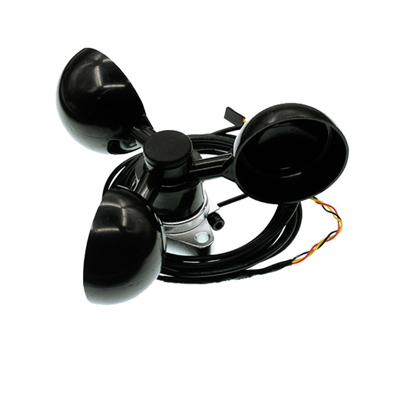

# Octopus Wind Speed Sensor Anemometer Three Aluminium Cups(EF04083) 

## Introduction

This is a wind speed sensor with waterproof design. It has a standard connector for Octopus brick series’ products. Bigger wind speed brings higher output voltage. 

 

## Products Link

[ELECFREAKS Octopus Wind Speed Sensor](https://www.elecfreaks.com/octopus-wind-speed-sensor-anemometer-three-aluminium-cups.html)

## Characteristics

The 3-pins ports is easy to plug and play.

## Specifications

Item | Parameter 
:-: | :-: 
SKU|EF04083
Power Dissipation|ULP
Working Temperature|-20-70℃
Working Voltage|3.3-5V

## Outlook and Dimensions

## Quick to Start

### Materials used and connection diagram

 Connect to P1 port.
 It needs to use power module to give power.
### Add Package

Click "Advanced"in the choice of the MakeCode to find more choices.

 

Click "Extensions", search "iot"in the dialog box and then download it.

 

### Program as the picture shows

  

### Reference

Links:[https://makecode.microbit.org/_D8WLUvFCm8Kq](https://makecode.microbit.org/_D8WLUvFCm8Kq)

You can also download the links below:

<iframe style="position:absolute;top:0;left:0;width:100%;height:100%;" src="https://makecode.microbit.org/#pub:_D8WLUvFCm8Kq" frameborder="0" sandbox="allow-popups allow-forms allow-scripts allow-same-origin"></iframe>
  

### Result
 The current wind speed is showing on the micro:bit.

## Relevant Cases

## Technique Files

