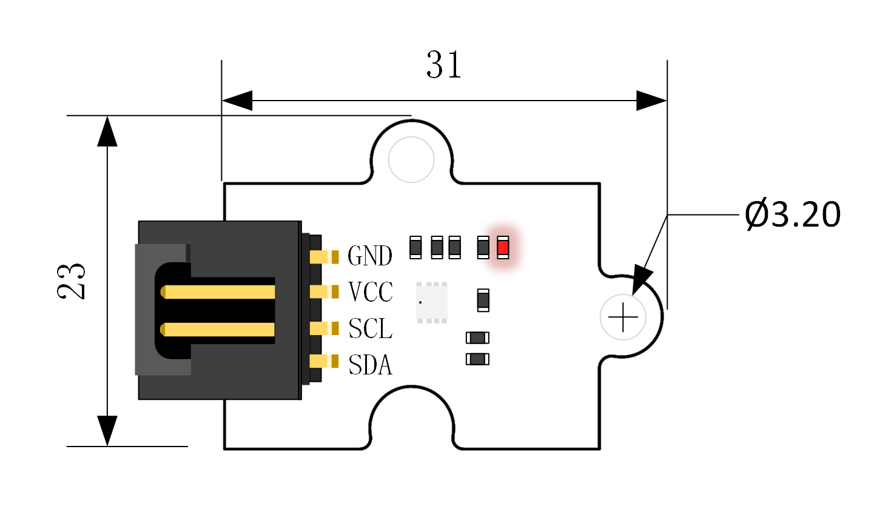
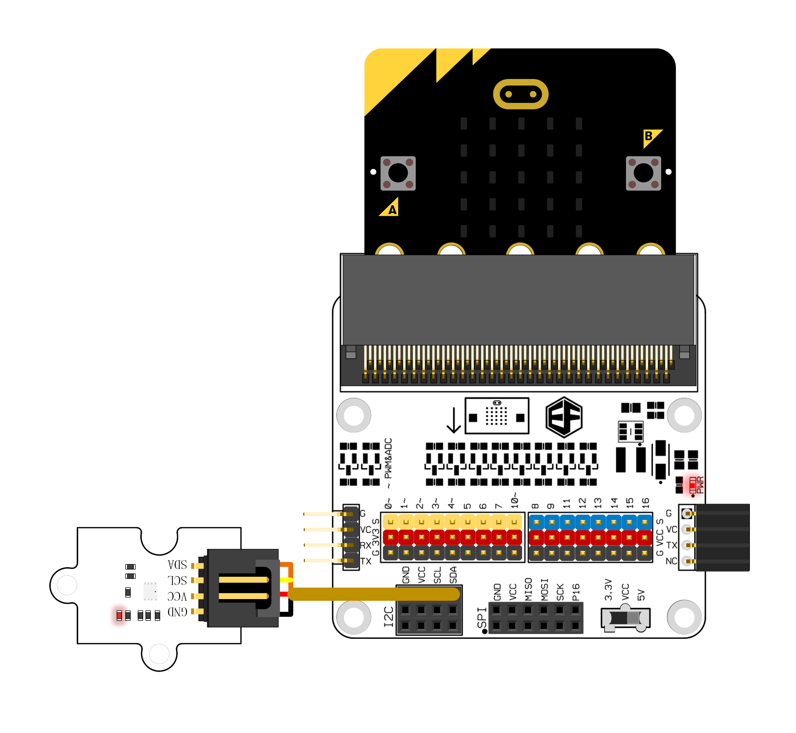
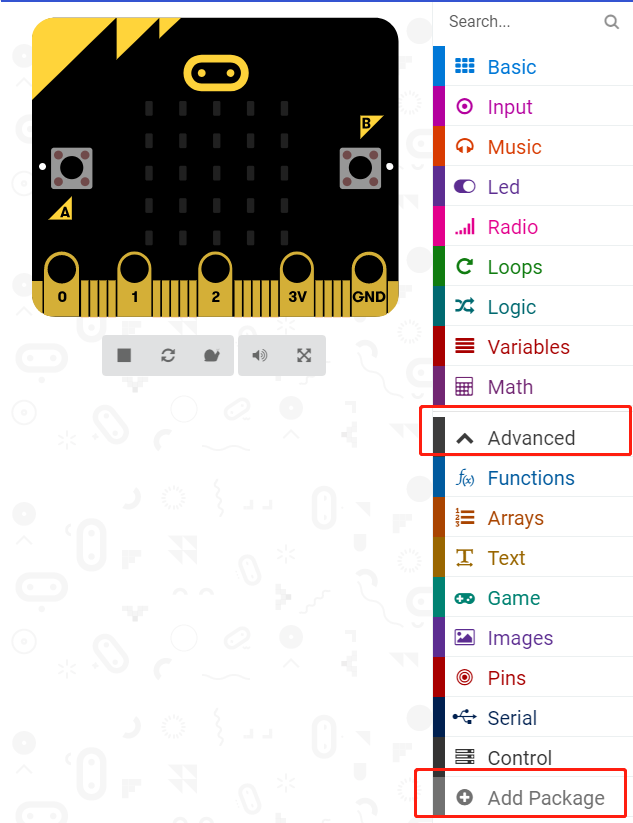
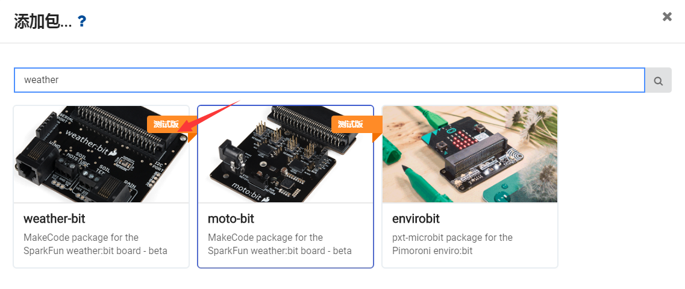
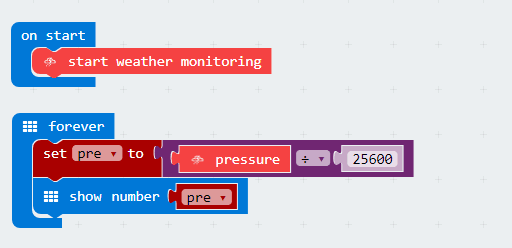

# BME280 Air Pressure Sensor(EF04087) 

## Introduction
---
Octopus BME280 Pressure Sensor is an electric brick integrating temperature sensor, air pressure sensor and humidity sensor onboard. We can use it to  calculate the altitude according to the measured air pressure.

## Characteristics
---
- Low power consumption and small size.
- 3mm standard positioning hole.
- 3.3v power supply
- Support I2C and SPI protocol.
- 
## Parameter
---

Item | Parameter 
:-: | :-: 
Name|Octopus BME280 Pressure Sensor
Version|V1.0
SKU| EF04087
Working Voltage|DC 1.2V-3.6V
Connector Type|IIC（mode 3.4MHz）or SPI（3-wire or 4-wire mode10MHz）
Relative Humidity Range|0%～100% , response time：over 1s
Humidity Tolerance|±2%；Humidity Hysteresis：±1%；Resolution: 0.8%
Air Pressure Measure Range|300～1100hPa
Air Pressure Tolerance|±1hPa 分辨率0.18Pa
Temperature Measure Range|0℃～65℃
Temperature Tolerqance|±0.5℃ Max:±1℃；Resolution: 0.1℃
Size|31 x 23 mm

### Outlook and Dimensions

## Quick to Start
---
### Hardware Connection

Connect the sensor to I2C connector on octopus:bit using a jumper cable. Insert micro:bit into the octopus:bit.

### Software Programming

#### Purpose
Test the air pressure value and show it on the micro:bit.

#### Add Package
Click "Advanced"in the choice of the MakeCode to find more choices.

Click "Add Package", search "weather"in the dialog box and then download weather-bit.

Program as the picture shows and read the air pressure value:  

#### Links:
[https://makecode.microbit.org/_cPih8ybrDXuz](https://makecode.microbit.org/_cPih8ybrDXuz)

You can also download the links below:

<iframe style="position:absolute;top:0;left:0;width:100%;height:100%;" src="https://makecode.microbit.org/#pub:_0Eji5aiUVWPi" frameborder="0" sandbox="allow-popups allow-forms allow-scripts allow-same-origin"></iframe>

### Result
The air pressure value is scrolling on the micro:bit, the unit is MPa.

## FAQ
---
