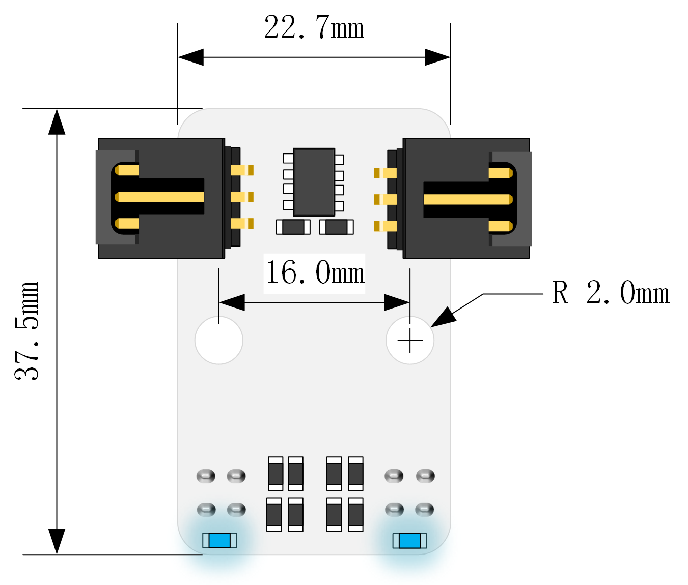
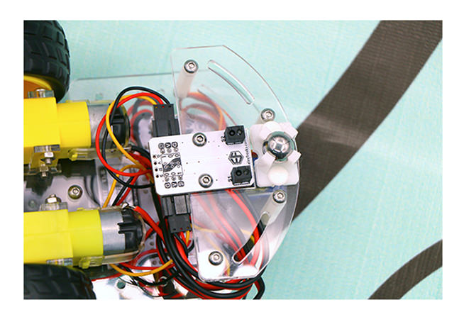

# Octopus 2 Channel Tracking Module(EF04088) 

## Introduction
---
Octopus 2 Channel Tracking Module has integrated two groups of reflective infrared pair diode, which can be used to identify black lines. This module is usually used to make line tracking smart cars. We can design black track at will and make our cars follow it through programming. 

## Characteristics
---
- Strong anti-interference by using infrared detection.
- Positioning holes are compatible with main-stream smart car chassis.
- Equipped with two 3-pin wire GVS jumper cables and 4-pin soldering plate,  the two 3-pin ports can be connected directly to two GVS wires.

## Parameter
---

Item | Parameter 
:-: | :-: 
Name|Octopus 2 Channel Tracking Module
SKU|EF04088
Working Voltage|DC 3-5V
Connector Type|Two standard G-V-S connectors
Output Signal Type|Digital
Output Voltage of Black Line|Low
Output Voltage of White Line|High
Effective Range|2~12mm
Size|22.74 x 37.45mm
NW|4.8g

### Outlook and Dimensions

## Packing List
---
- 1 x Octopus 2 Channel Tracking Module。
- 2 x 3PGVS umper Cable

## Quick to Start
---
### Hardware Connection
Connect this module to your micro:bit car.
Connect the left port to P13 and the right port to P14. (Based on the driver's angle of view)

 

### Code Example
Links: https://makecode.microbit.org/_Ep84RMKkhcHs
You can also download the links below:

<iframe style="position:absolute;top:0;left:0;width:100%;height:100%;" src="https://makecode.microbit.org/#pub:_Ep84RMKkhcHs" frameborder="0" sandbox="allow-popups allow-forms allow-scripts allow-same-origin"></iframe>

### Result
Place the car on the black line, turn on the switch, then it will move forward along the black line.

## FAQ
---
