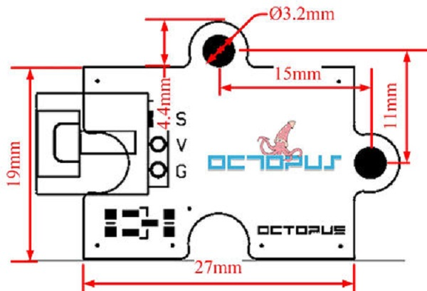
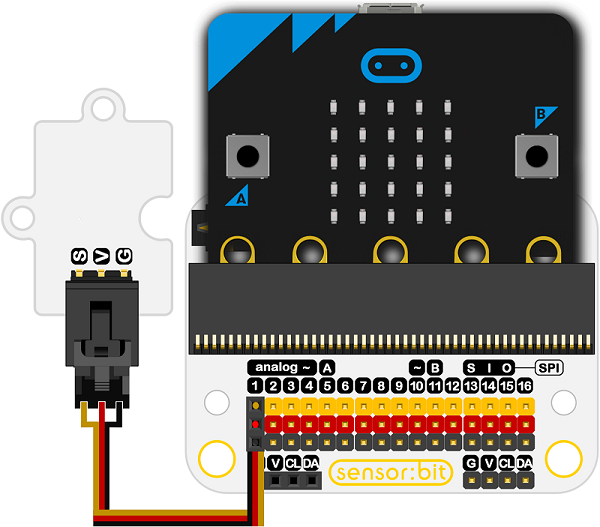

# Octopus Water-proof Temperature Sensor(EF04095)

## Introduction
---
- This sensor is a tempeterature detector used to test the liquid temperature based on 18b20.

 

## Characteristics
---

- Standard 3-pin GVS ports is easy to plug.
- 3V working voltage can drive the micro:bit.
- Water-proof design makes it possible to use in the liquid.

## Specification
---

- SKU：EF04095
- Working Voltage：DC 3.0V
- Power Supply：3v-5v
- Connector Type：Analog
- Length of water-proof detector：1m
- Pins Definition：1-Signal 2-VCC 3-GND
- Response：Quick to response and high sensiivity
- Circuit：Simple drive circuit 
- Stability：Stable and durable

## Outlook and Dimensions
---

 

## Quick to Start
---
### Connection Diagram

- Connect to the P1 port of the extension board.

 

###  Add Package

Click "Advanced" in MakeCode to check more choices.

 

Click "Extensions", and search “`https://github.com/elecfreaks/pxt-ds18b20`" in the dialogue box to download the codebase of 18b20.

### Programme as the Picture Shows

  

### Reference

Links: [https://makecode.microbit.org/_1x1ERwiT1bui](https://makecode.microbit.org/_1x1ERwiT1bui)

You can also download it directly: 

<iframe style="position:absolute;top:0;left:0;width:100%;height:100%;" src="https://makecode.microbit.org/#pub:_1x1ERwiT1bui" frameborder="0" sandbox="allow-popups allow-forms allow-scripts allow-same-origin"></iframe>
  

### Results

- The current temperature value is showing on the micro:bit.

## Relevant Cases
---

## Technique Files
---
