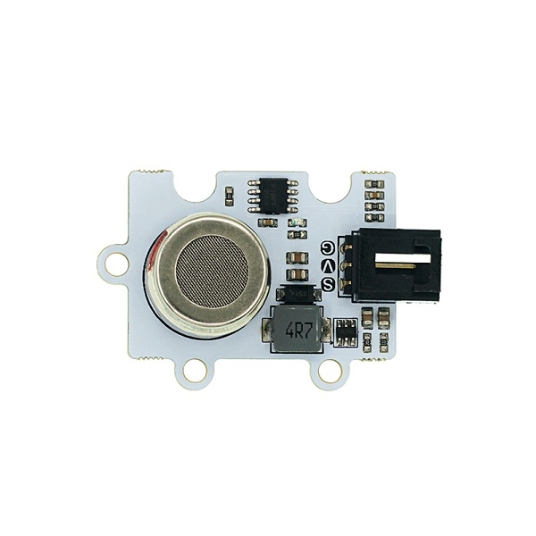
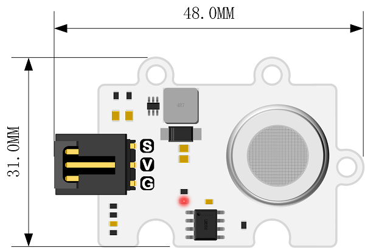
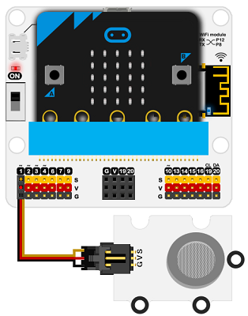
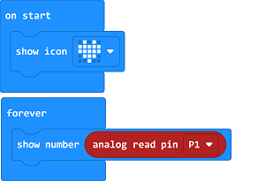
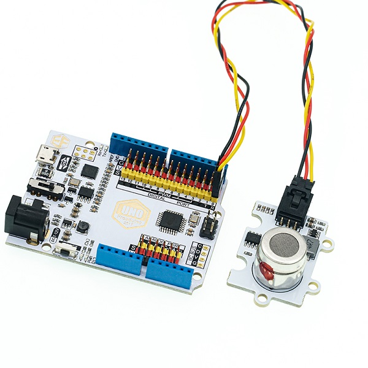

# MG811 CO2 Gas Sensor(EF04100)

## Introduction

Octopus MG811 CO2 Gas Sensor is a CO2 electronic brick in our OCTOPUS series, the basic design for the outlook, PCB fixing holes and connections are the same with them.

The higher the CO2concentration is, the lower the output voltage would be. The users can read the CO2 value easily after checking our brochures and coding samples.

The CO2 probe is made with industrial grade which is high allergic to CO2 and anti-interference to alcohol and CO. It is of high performance and quick response with loaded signal amplification circuit even in different temperature and humidity environment. Besides, the heating circuit on-board helps to convert to stable 6V voltage from 5V directly that improves the adaptability of the module.

***Caution：***

 The module belongs to electrochemistry CO2 and the probe heats itself when working, please do not touch in case of getting hurt.
 Please make a seal preservation while the sensor is not in use in case of the probe getting “poisoned” due to the long time exposure in the air or you have to heating continuously another 48 hours to activate it!
 The MG-811 probe belongs to the category of electrochemistry sensor, please make a proving operation for it before using to get an accurate value.
 
 ***CO2 sensors need to be connected using an expansion board with an independent power supply interface: iot:bit with an independent USB power supply is recommended***


## Products Link

[ELECFREAKS Octopus CO2 Gas Sensor (MG811)](https://shop.elecfreaks.com/products/elecfreaks-octopus-co2-gas-sensor-mg811?_pos=1&_sid=e0bdf8a27&_ss=r)


## Characteristic


 Working voltage of the probes: 6v
 With booster circuit inbuilt, it supports input DC 3.7~5V and the current over 500mA.
 OCTOPUS electronic bricks.
 Easy connection.

## Parameter


 Item:  MG811 CO2 Gas Sensor
 SKU：EF04100
 Working Voltage: DC 3.7~5v
 Connection Mode: G-GND，V-VCC，S-pin signals
 Size: 31 * 48mm
 Net Weight: 9.6g

## Outlook and Dimension




## Quick to Start

## Materials Required and Connection Diagram
 Connect CO2 sensor to P1on the breakout board as the picture shows.

***Take iot：bit for an example***



### Code as below



### Reference
Link：[https://makecode.microbit.org/_KJVXj9Co2UXU](https://makecode.microbit.org/_KJVXj9Co2UXU)

You may also download it directly below:

<div style="position:relative;height:0;padding-bottom:70%;overflow:hidden;"><iframe style="position:absolute;top:0;left:0;width:100%;height:100%;" src="https://makecode.microbit.org/#pub:_KJVXj9Co2UXU" frameborder="0" sandbox="allow-popups allow-forms allow-scripts allow-same-origin"></iframe></div>  


### Result
 After connecting the hardware, please preheating it for 3 minutes, and please operate it with the probe approaching to the detected gas only if you get a stable value. 
 With the concentration of the CO2 changed in its surroundings, the value on the micro:bit led shall change accordingly.

## Python Programming


### Step 1
Download and unzip the package:[Octopus_MicroPython-master](https://github.com/lionyhw/Octopus_MicroPython/archive/master.zip)
Go to [Python editor](https://python.microbit.org/v/2.0)


For programming, we need to add a file of co2.py. Click Load/Save fisrt and again with Show Files(1), choose "add file" to and get to the download page to find the file folder of Octopus_MicroPython-master, then add co2.py.


### Step 2
### Reference
```
from microbit import *
from co2 import *

co2 = CO2(pin1)
while True:
    print(co2.get_co2())
```


### Result
 The detected value displays on the micro:bit. 

###  Hardware

Connect the sensor to pin A0 on Arduino UNO board with a buckled dupont wire, make sure the board be powered with a standalone power source(7.5V-9V).



###  Software Programming

#### Standard Operation

Please make a proving/standard operation for it before using to get an accurate value:
Make sure to power it with a stable power source, and the probe itself will be preheated. Please place it in the fresh air for 48 hours. Testing the output voltage(unit: V) and have it devided by 8.5 to get an answer, finally fill it in to the Macro definition in the code:

```
#define ZERO_POINT_VOLTAGE (Please revise to: Voltage(V)/8.5) 
```

For example: the output voltage tested by the multimeter from the CO2 is 2.4V, thus we should calculate with an answer 0.282(2.4/8.5=0.282), and we will need to write the answer in the below program. 

```
#define ZERO_POINT_VOLTAGE (0.282) 
```

Now please upload it to the Arduino board to start the future measurement. 

#### Code example
```
/*******************Demo for MG-811 Gas Sensor Module V1.1*****************************
************************************************************************************/

/************************Hardware Related Macros************************************/
#define         MG_PIN                       (A0)     //define which analog input channel you are going to use
#define         DC_GAIN                      (8.5)   //define the DC gain of amplifier

/***********************Software Related Macros************************************/
#define         READ_SAMPLE_INTERVAL         (50)    //define how many samples you are going to take in normal operation
#define         READ_SAMPLE_TIMES            (5)     //define the time interval(in milisecond) between each samples in 
                                                     //normal operation

/**********************Application Related Macros**********************************/
//These two values differ from sensor to sensor. user should derermine this value.
#define         ZERO_POINT_VOLTAGE           (0.220) //define the output of the sensor in volts when the concentration of CO2 is 400PPM
#define         REACTION_VOLTGAE             (0.030) //define the voltage drop of the sensor when move the sensor from air into 1000ppm CO2

/*****************************Globals***********************************************/
float           CO2Curve[3]  =  {2.602,ZERO_POINT_VOLTAGE,(REACTION_VOLTGAE/(2.602-3))};   
                                     //two points are taken from the curve. 
                                     //with these two points, a line is formed which is
                                     //"approximately equivalent" to the original curve.
                                     //data format:{ x, y, slope}; point1: (lg400, 0.324), point2: (lg4000, 0.280) 
                                     //slope = ( reaction voltage ) / (log400 –log1000) 

void setup()
{
   Serial.begin(9600);              //UART setup, baudrate = 9600bps
   Serial.print("MG-811 Demostration\n");                
}

void loop()
{
    int percentage;
    float volts;

    volts = MGRead(MG_PIN);
    Serial.print( "SEN0159:" );
    Serial.print(volts); 
    Serial.print( "V           " );

    percentage = MGGetPercentage(volts,CO2Curve);
    Serial.print("CO2:");
    if (percentage == -1) {
        Serial.print( "<400" );
    } else {
        Serial.print(percentage);
    }

    Serial.print( "ppm" );  
    Serial.print("\n");

    delay(500);
}

/*****************************  MGRead *********************************************
Input:   mg_pin  analog channel
Output:  output of SEN-000007
Remarks: This function reads the output of SEN-000007
************************************************************************************/ 
float MGRead(int mg_pin)
{
    int i;
    float v=0;

    for (i=0;i<READ_SAMPLE_TIMES;i++) {
        v += analogRead(mg_pin);
        delay(READ_SAMPLE_INTERVAL);
    }
    v = (v/READ_SAMPLE_TIMES) *5/1024 ;
    return v;  
}

/*****************************  MQGetPercentage **********************************
Input:   volts    SEN-000007 output measured in volts
         pcurve   pointer to the curve of the target gas
Output:  ppm of the target gas
Remarks: By using the slope and a point of the line. The x(logarithmic value of ppm) 
         of the line could be derived if y(MG-811 output) is provided. As it is a 
         logarithmic coordinate, power of 10 is used to convert the result to non-logarithmic 
         value.
************************************************************************************/ 
int  MGGetPercentage(float volts, float *pcurve)
{
   if ((volts/DC_GAIN )>=ZERO_POINT_VOLTAGE) {
      return -1;
   } else { 
      return pow(10, ((volts/DC_GAIN)-pcurve[1])/pcurve[2]+pcurve[0]);
   }
}
```


### Result

Open the serial monitor and you should get the data of the CO2 concentration 5 minutes later. 

## FAQ

