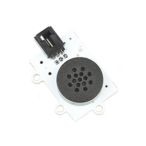
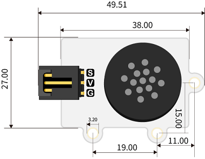
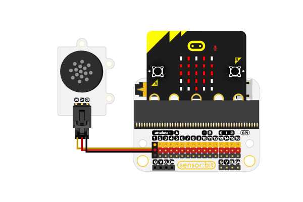
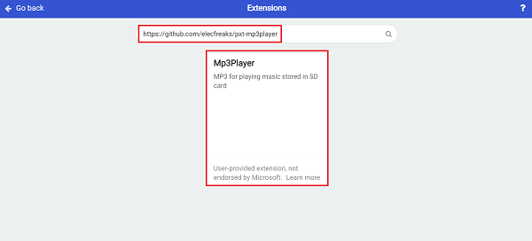
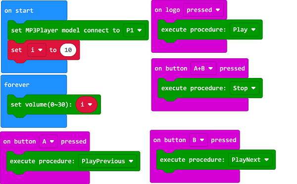

# MP3 Module(EF04104)

## Introduction
---
It is able to play the music.

## Specification
---

Item | Parameter 
:-: | :-: 
SKU|EF04104
Connection|3P wire
Connection Type|Digital input
Working Voltage|3.3V
Core IC|YX6300

## Outlook and Dimension
---

## Quick to Start
---

### Materials required and connection diagram

- Connect the MP3 module to P1 port on sensor:bit. 

## MakeCode Program
---

### Step 1
Click “Advanced” in the drawer of the MakeCode to see more choices.

We need to add a package for programming. Click “Extensions” in the bottom of the drawer and search with “https://github.com/elecfreaks/pxt-mp3player ” in the dialogue box to download it.

***Note:*** If you met a tip indicating that the codebase will be deleted due to incompatibility, you may continue as the tips say or build a new project in the menu.

### Step 2

### Code as below

### Link
Link: [https://makecode.microbit.org/_9MhgxtXgK5x7](https://makecode.microbit.org/_9MhgxtXgK5x7)

You may also download it directly below:

<iframe style="position:absolute;top:0;left:0;width:100%;height:100%;" src="https://makecode.microbit.org/#pub:_9MhgxtXgK5x7" frameborder="0" sandbox="allow-popups allow-forms allow-scripts allow-same-origin"></iframe>
  

### Result
- The MP3 module is controlled by the microbit.

### Attention

Physical copy sequence, the first copy is 1. The name of the file can be left unchanged, and the file name cannot be specified separately.

The name of the file folder must be 2 digits(01~99), such as: 01. 

The name of the MP3 file must include 3 digits(001~999), such as: 002~Palace.MP3.

