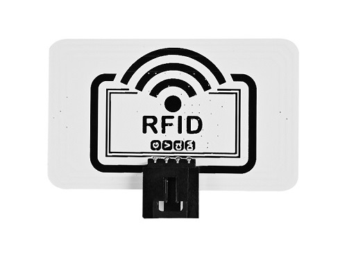
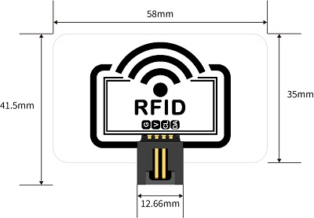
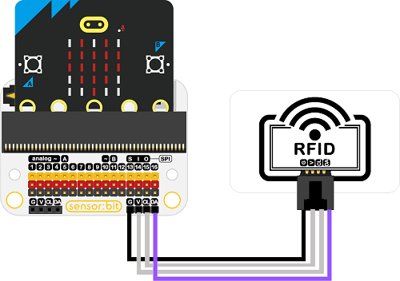
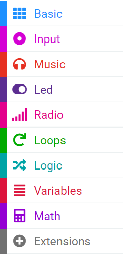
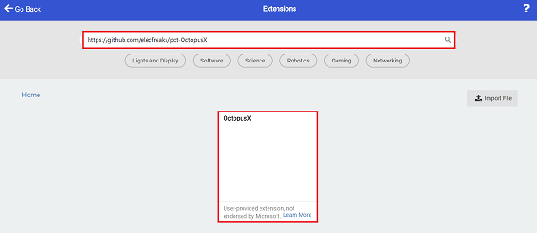
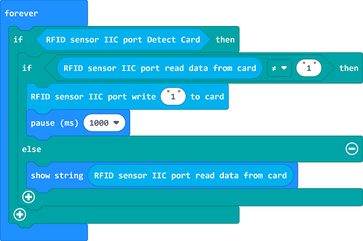
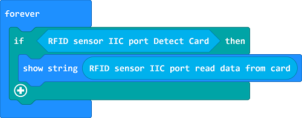

# RFID Sensor(EF04105)

## Introducion
RFID sensor uses the wireless radio frequency method to read and write to the recording media (electronic tag or radio frequency card), so as to achieve the purpose of recognizing the target and data exchange.

## Products Link

[ELECFREAKS Octopus RFID](https://shop.elecfreaks.com/products/elecfreaks-octopus-rfid?_pos=1&_sid=392a6f5da&_ss=r)

## Characteristics

The three pins GVS design is easy to plug and play. 

## Specifications

Item | Parameter 
:-: | :-: 
SKU|EF04105
Connections|IIC
Connections Type|IIC
Working Voltage|3.3V
Rated Current|50mA
Core IC|PN5321A3

## Outlook and Dimensions

## Quick to Start 

### Materials required and connections diagram

Connect the RFID sensor with the IIC port on Sensor:bit as the picture shows. 

## MakeCode Programming

### Add Extensions
Click `Extensions` in the MakeCode drawer to see more choices. 

For programming, we need to add a package: click "Extensions" at the bottom of the MakeCode drawer and search with `https://github.com/elecfreaks/pxt-OctopusX` in the dialogue box to download it. 

Notice: If you met a tip indicating that some codebases would be deleted due to incompatibility, you may continue as the tips say or create a new project in the menu. 

###  Write Data via the RFID

Reference link: [https://makecode.microbit.org/_19ePfj3idL1h](https://makecode.microbit.org/_19ePfj3idL1h)

You may also download it directly below:

<iframe style="position:absolute;top:0;left:0;width:100%;height:100%;" src="https://makecode.microbit.org/#pub:_19ePfj3idL1h" frameborder="0" sandbox="allow-popups allow-forms allow-scripts allow-same-origin"></iframe>
  

### Result 
After poweing on, put the electronic tag underneath the RFID, and the RFID shall write the data in the tag, then read the tag via the RFID and the data shall be displayed on the micro:bit screen. 

### RFID Reads Data

Reference link: [https://makecode.microbit.org/_fXU8hWYc9Lhu](https://makecode.microbit.org/_fXU8hWYc9Lhu)

You may also download it directly below:

<iframe style="position:absolute;top:0;left:0;width:100%;height:100%;" src="https://makecode.microbit.org/#pub:_fXU8hWYc9Lhu" frameborder="0" sandbox="allow-popups allow-forms allow-scripts allow-same-origin"></iframe>
  

### Result
After poweing on, put the electronic tag underneath the RFID,  the data shall be displayed on the micro:bit screen after reading the tag via the RFID. 
