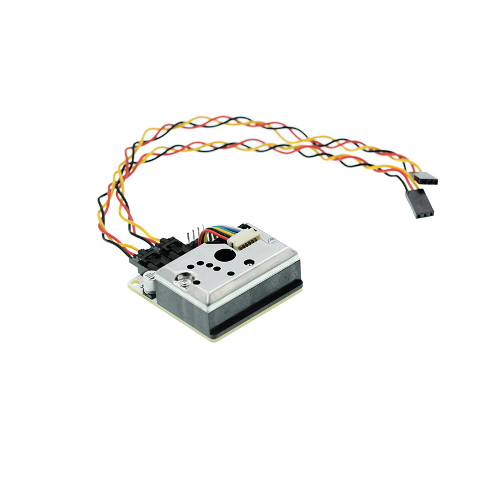
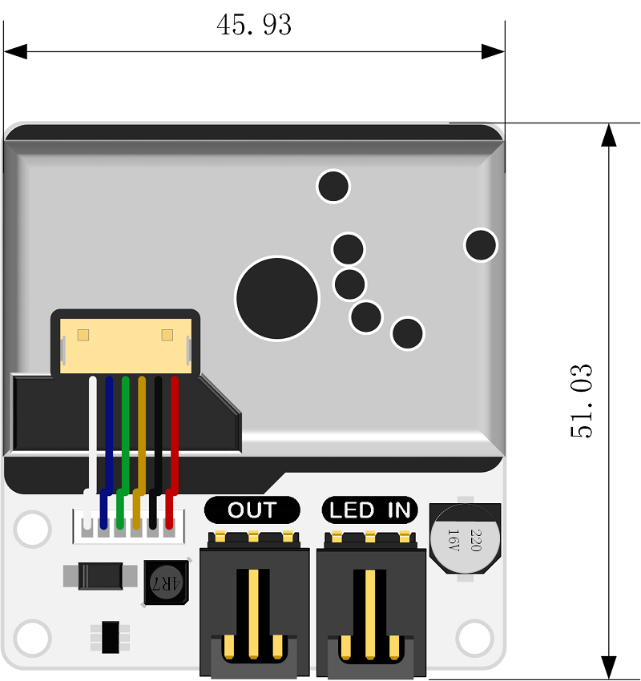
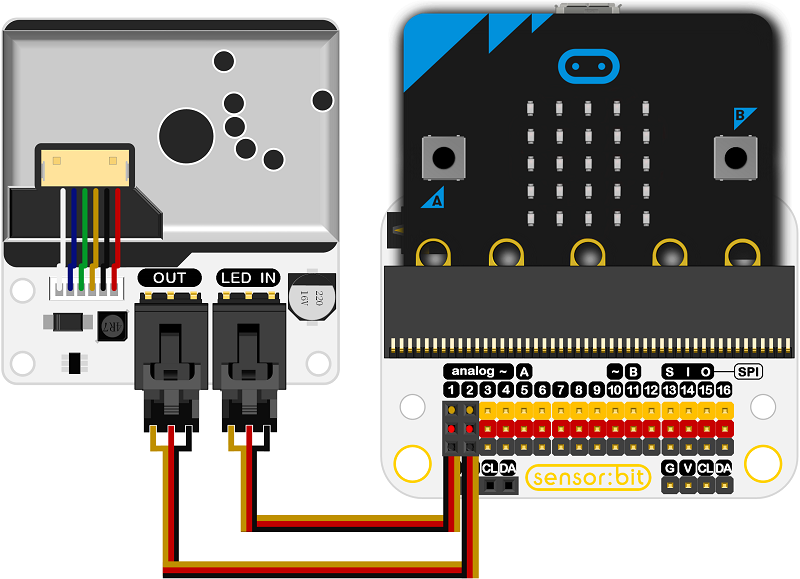
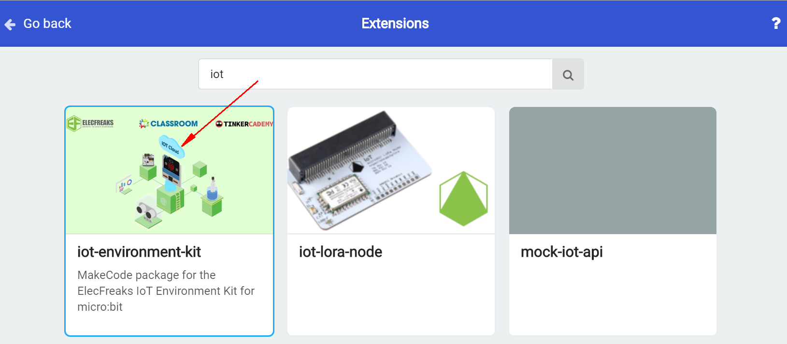

# Octopus Dust Sensor Detector Module with Sharp GP2Y1010AU0F(EF11083)

## Introduction
---
Octopus Dust Sensor Detector Module with Sharp GP2Y1010AU0F adopts Sharp optical dust sensor(GP2Y1010AU0F). It is used to detect the density of  dust particle with diameter beyond 0.8μm such as cigarette smoke.

 

## Characteristics
---
The 3-pins ports is easy to plug and play.

## Specifications
---

Item | Parameter 
:-: | :-: 
SKU|EF11083
Sensitivity|0.5V /（100μg/ m3）
Effect Range|500μg/ m3
Working Voltage|2.5V~5.5V
Working Current|20mA（Max）
Working Temperature|-10℃~65℃
Storage Temperature|-20℃~80℃
Service Life|5 years
Product Dimension|63.2mm×41.3mm×21.1mm
Fixed Hole Size|2.0mm
Vent Hole Size|9.0mm

## Outlook and Dimensions
---

 

## Quick to Start
---

### Materials used and connection diagram

- Connect the LED to P2 port and the out port to P1 port as the picture shows.

***Take sensor:bit for example***

 

### Add Package

Click "Advanced"in the choice of the MakeCode to find more choices.

Click "Extensions", search "iot"in the dialog box and then download the "iot".

### Program as the picture shows
1. Choose the LED on the micro:bit to show the bricks.
2. Choose the dust brick in the IoT package to show it on the micro:bit.

 

***Reference***

Links: [https://makecode.microbit.org/_Fp7JYc0Wh9hY](https://makecode.microbit.org/_Fp7JYc0Wh9hY)

You can also download the links below:

<iframe style="position:absolute;top:0;left:0;width:100%;height:100%;" src="https://makecode.microbit.org/#pub:_Fp7JYc0Wh9hY" frameborder="0" sandbox="allow-popups allow-forms allow-scripts allow-same-origin"></iframe>
  

### Result
- The current value of the smoke level is showing on the micro:bit.

## Relevant Cases
---

## Technique Files
---
