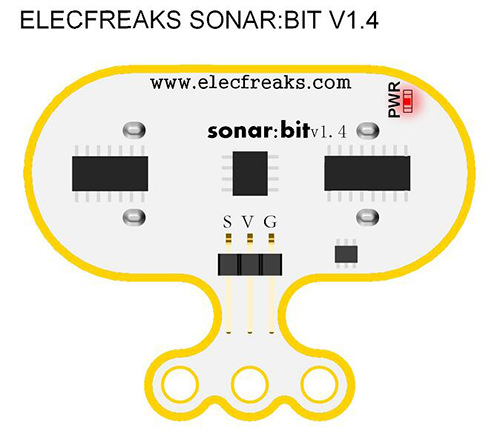
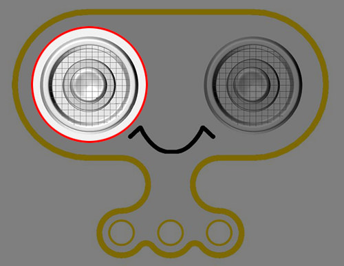
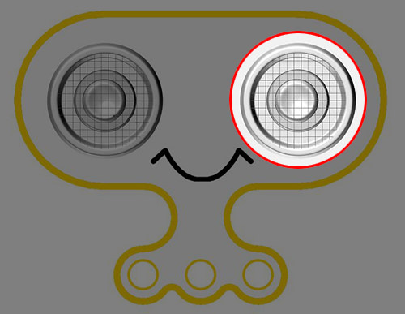
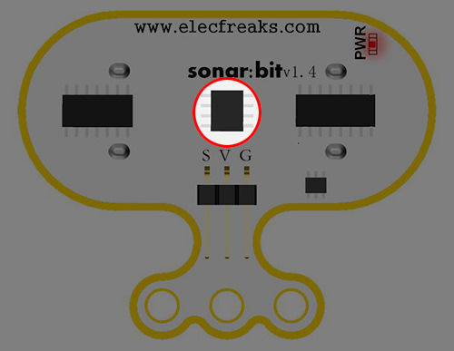
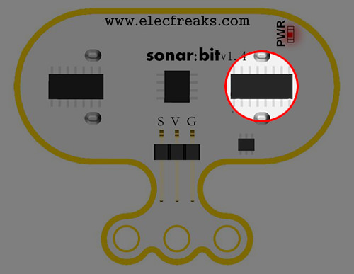
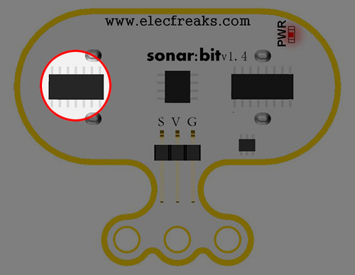
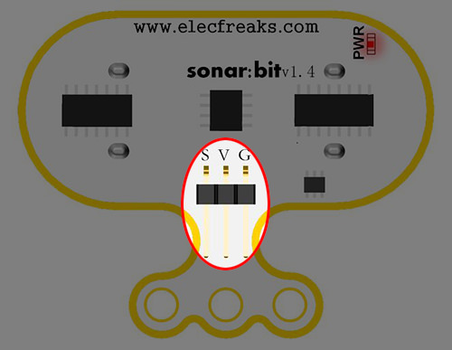
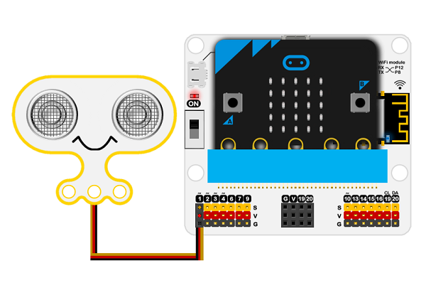
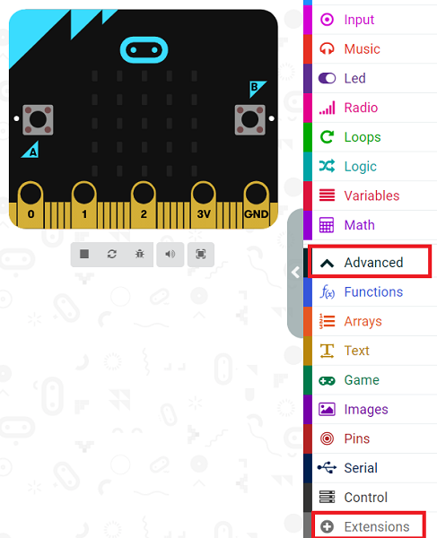

# Sonar:bit(F04089)

## Introduction

Sonar:bit is a 3-wire ultrasonic module with the working voltage between 3-5V. It is available to be used to 3.3V or 5V micro-controller system. With only one 3-wire(GVS) cable, it can work properly. Compared to the normal 4-wire ultrasonic module, it has saved one IO port. The measurement range of sonar:bit is 4cm-400cm. It can output stable and accurate measurement data with ±1cm tolerance only. It's available for short distance measuring in robtics device, micro:bit and Arduino etc.

## Products Link

[ELECFREAKS Octopus Sonar:bit)](https://www.elecfreaks.com/sonar-bit-for-micro-bit-ultrasonic-sensor-distance-measuring-3v-5v.html)

## Characteristics 

 The input voltage is 3V~5V, both micro:bit and Arduino are able to drive it.

 Standard 3-GVS cable, occupy one IO port only. 

## Specification

|Item| Parameter |
| :-: | :-: |
|Name| Sonar:bit|
|SKU|EF04089|
|Input Voltage|DC 3-5V|
|Measurement Distance|4-400cm|
|Tolerance|1cm|
|Size |40.60× 51.60mm|
|Net Weight|12g|

## Outlook and dimensions

## Pins diagram 

The probes send out and receive ultrasonic signals. 

## Main parts information

### Emitting probes

The emmiting probes send out ultrasonic signals. 

### Receving probes

The receiving probes receive ultrasonic signals. 

### Chips MCU

Core controlling chips

### Emitting signals driving chips

The transmitting signal driving chip is used to provide the transmitting ultrasonic signal for driving the ultrasonic transmitting probe.

### Receiving signals driving chips

The receiving signal processing chip is used for receiving and processing the ultrasonic echo signal, and feeding back the processed signal to the main control chip.

### G-V-S controlling port 

G-V-S are used for the controlling of the sonar:bit by other devices. 

## Quick start

### Materails required and connections diagram

 Connect the sonar:bit to the P1 port of the iot:bit and the micro:bit to the computer. 

***Take iot:bit for an example***

### Step 1
 Click “Advanced“ in the MakeCode drawer and click “Extentions“ to see more choices. 

We need to add a package for programming, . Click “Extensions” in the bottom of the drawer and search with “https://github.com/elecfreaks/pxt-sonarbit” in the dialogue box to download it.

Note: If you met a tip indicating that the codebase will be deleted due to incompatibility, you may continue as the tips say or build a new project in the menu.

### Step 2
In forever block, show the returned value from Sonar:bit in digit. 

### Reference
Link: [https://makecode.microbit.org/_eyU2yC79fXyc](https://makecode.microbit.org/_eyU2yC79fXyc)

You may also download it directly below:

<iframe style="position:absolute;top:0;left:0;width:100%;height:100%;" src="https://makecode.microbit.org/#pub:_eyU2yC79fXyc" frameborder="0" sandbox="allow-popups allow-forms allow-scripts allow-same-origin"></iframe>
  

### Result

 The distance between the ultrasonic module and the object is displayed on the micro:bit with unit in cm.

## Relevant Projects

## Technical File

