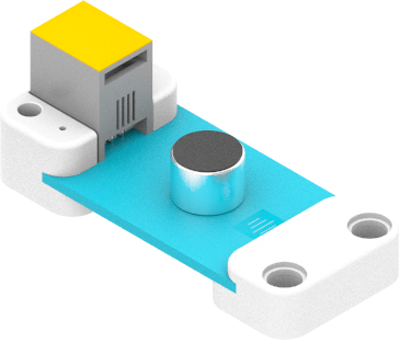
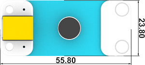
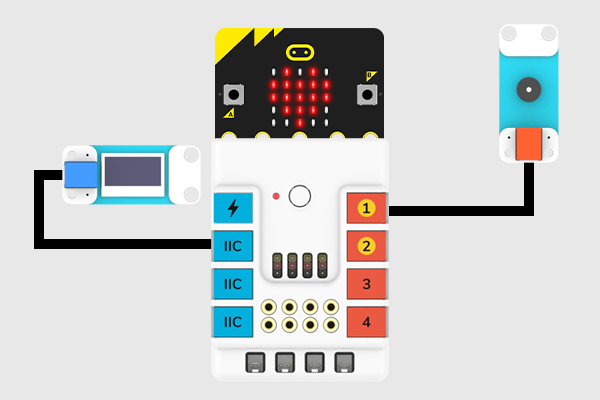
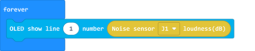
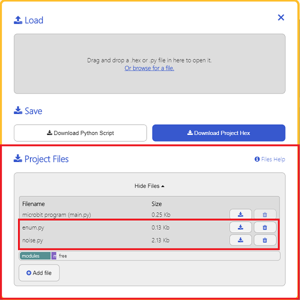

# Sound Sensor(EF05003)

## Introduction

Sound Sensor is particularly sensitive to sound intensity, and it can be used to detect ambient sound level.



## Products Link

[ELECFREAKS PlanetX Noise Sensor](https://www.elecfreaks.com/planetx-noise.html)

## Characteristic


 Designed in RJ11 connections, easy to plug.

## Specification


Item | Parameter 
:-: | :-:
SKU|EF05003
Connection|RJ11
Type of Connection|Analog output
Working Voltage|3.3V
Size|55.8 x 23.8 mm


## Outlook




## Quick to Start


### Materials Required and Diagram

 Connect the sound sensor to J1 port and the OLED module to IIC port in the Nezha expansion board as the picture shows. 




## MakeCode Programming


### Step 1

Click "Advanced" in the MakeCode drawer to see more choices. 


We need to add a package for programming, . Click "Extensions" in the bottom of the drawer and search with "PlanetX" in the dialogue box to download it. 


***Note:*** If you met a tip indicating that the codebase will be deleted due to incompatibility, you may continue as the tips say or build a new project in the menu. 
### Step 2

### Code as below:




### Link
Link: [https://makecode.microbit.org/_Vr4PPtfefeWw](https://makecode.microbit.org/_Vr4PPtfefeWw)

You may also download it directly below: 

<div style="position:relative;height:0;padding-bottom:70%;overflow:hidden;"><iframe style="position:absolute;top:0;left:0;width:100%;height:100%;" src="https://makecode.microbit.org/#pub:_Vr4PPtfefeWw" frameborder="0" sandbox="allow-popups allow-forms allow-scripts allow-same-origin"></iframe></div>  


### Result
 The value of the sound(dB) in the current environment displays on the OLED module. 

## Python Programming 


### Step 1

Download the package and unzip it: [PlanetX_MicroPython](https://github.com/lionyhw/PlanetX_MicroPython/archive/master.zip)

Go to   [Python editor](https://python.microbit.org/v/2.0)


We need to add enum.py and noise.py for programming. Click "Load/Save" and then click "Show Files (1)" to see more choices, click "Add file" to add enum.py and noise.py from the unzipped package of PlanetX_MicroPython. 




### Step 2

### Reference

```

from microbit import *
from enum import *
from noise import *

while True:
    noise = NOISE(J1)
    noise_value = int(noise.get_noise())
    display.scroll(str(noise_value))
        
```


### Result
 The value of the sound(dB) in the current environment displays on the micro:bit. 
## Relevant File


## Technique File

