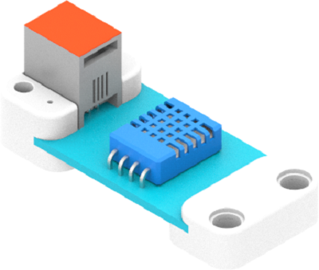
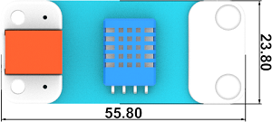
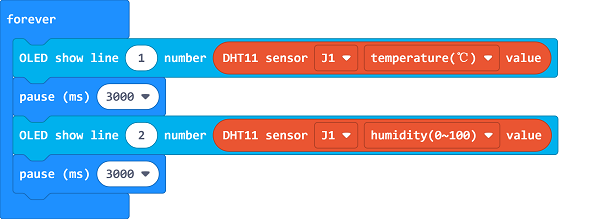

# Temperature and Humidity Sensor(EF05004)

## Introduction
---
Temperature and humidity sensor is a module based on DHT11 digital temperature and humidity sensing element. It is sensitive to the ambient temperature and humidity changes and can be used for temperature alarm, humidity testing and other works.

## Characteristic
---

Designed in RJ11 connections, easy to plug.

## Specification
---

Item | Parameter 
:-: | :-: 
SKU|EF05004
Connection|RJ11
Type of Connection|Digital output
Working Voltage|3.3V
Size|55.8 x 23.8 mm

## Outlook
---

## Quick to Start
---

### Materials Required and Diagram

- Connect the DHT11 Temperature and humidity sensor to J1 port and the OLED module to IIC port in the Nezha expansion board as the picture shows. 

## MakeCode Programming
---

### Step 1

Click "Advanced" in the MakeCode drawer to see more choices. 

We need to add a package for programming, . Click "Extensions" in the bottom of the drawer and search with "PlanetX" in the dialogue box to download it. 

***Note:*** If you met a tip indicating that the codebase will be deleted due to incompatibility, you may continue as the tips say or build a new project in the menu. 

### Step 2

### Code as below:

Note: A delay of 3 seconds is required from detecting the temperature to the moisture while using the DHT11 temperature and moisture sensor. 

### Link
Link: [https://makecode.microbit.org/_00JcaH7D5066](https://makecode.microbit.org/_00JcaH7D5066)

You may also download it directly below: 

<iframe style="position:absolute;top:0;left:0;width:100%;height:100%;" src="https://makecode.microbit.org/#pub:_00JcaH7D5066" frameborder="0" sandbox="allow-popups allow-forms allow-scripts allow-same-origin"></iframe>
  

### Result
- The current values of the temperature and moisture display on the OLED module and they refresh every six seconds.

## Relevant File
---

## Technique File
---
