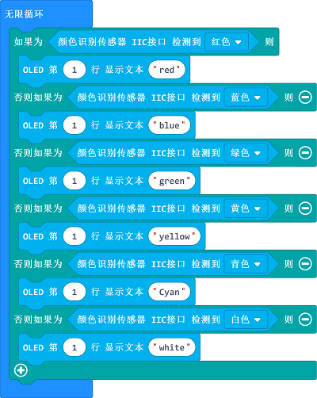
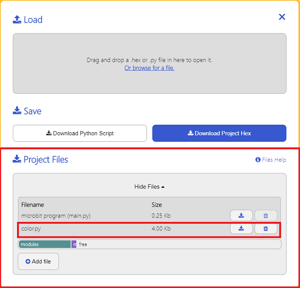

# Color Sensor(EF05006)

## Introduction

Color sensor aims to read the HUE values of the detected objects.  


## Products Link

[ELECFREAKS PlanetX Colour Sensor](https://shop.elecfreaks.com/products/elecfreaks-planetx-colour-sensor?_pos=1&_sid=2bf57f6a4&_ss=r)

## Characteristic

 Designed in RJ11 connections, easy to plug.

## Specification


Item | Parameter 
:-: | :-:
SKU|EF05006
Connection|RJ11
Type of Connection|IIC
Working Voltage|3.3V
Size|55.8 x 23.8 mm

## Outlook


## Quick to Start


### Materials Required and Diagram

 Connect the Color sensor to IIC port and the OLED module to another IIC port in the Nezha expansion board as the picture shows. 


## MakeCode Programming


### Step 1

Click "Advanced" in the MakeCode drawer to see more choices. 


We need to add a package for programming, . Click "Extensions" in the bottom of the drawer and search with "PlanetX" in the dialogue box to download it. 


***Note:*** If you met a tip indicating that the codebase will be deleted due to incompatibility, you may continue as the tips say or build a new project in the menu. 

### Step 2

### Code as below:




### Link
Link: [https://makecode.microbit.org/_1559o4XKEftb](https://makecode.microbit.org/_1559o4XKEftb)

You may also download it directly below: 

<div style="position:relative;height:0;padding-bottom:70%;overflow:hidden;"><iframe style="position:absolute;top:0;left:0;width:100%;height:100%;" src="https://makecode.microbit.org/#pub:_1559o4XKEftb" frameborder="0" sandbox="allow-popups allow-forms allow-scripts allow-same-origin"></iframe></div>  


### Result
 The color of the detected object displays on the OLED module.

## Python Programming 


### Step 1
Download the package and unzip it: [PlanetX_MicroPython](https://github.com/lionyhw/PlanetX_MicroPython/archive/master.zip)

Go to   [Python editor](https://python.microbit.org/v/2.0)


We need to add color.py for programming. Click "Load/Save" and then click "Show Files (1)" to see more choices, click "Add file" to add color.py from the unzipped package of PlanetX_MicroPython. 




### Step 2
### Reference
```
from microbit import *
from color import *
color = COLOR()
while True:
    display.scroll(color.get_hue())
```


### Result
 The HUE value displays on the micro:bit.

## Relevant File


## Technique File

