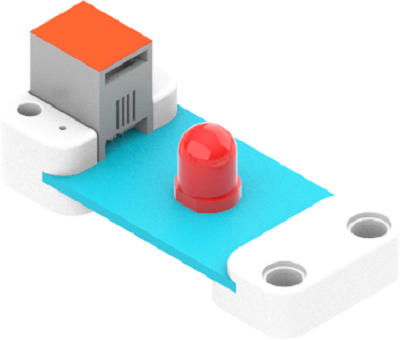
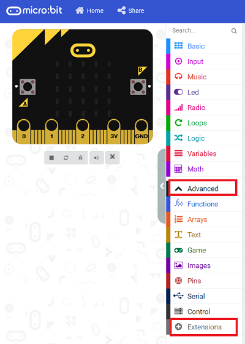
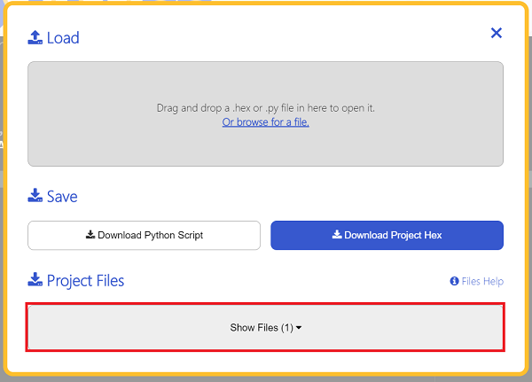
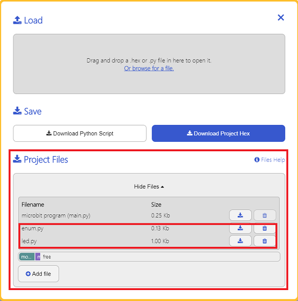

# Red LED(EF05009)

## Introduction

Red LED is usually used as the indicator. 




## Products Link

[ELECFREAKS PlanetX LED-Red](https://www.elecfreaks.com/planetx-led-red.html)

## Characteristic

 Designed in RJ11 connections, easy to plug.

## Specification


Item | Parameter 
:-: | :-:
SKU|EF05009
Connection|RJ11
Type of Connection|Analog input
Working Voltage|3.3V
Size|55.8 x 23.8 mm

## Outlook


## Quick to Start


### Materials Required and Diagram

 Connect the Red LED to J1 port and the potentiaometer to J2 port in the Nezha expansion board as the picture shows.


## MakeCode Programming


### Step 1

Click "Advanced" in the MakeCode drawer to see more choices.



We need to add a package for programming, . Click "Extensions" in the bottom of the drawer and search with "PlanetX" in the dialogue box to download it. 


***Note:*** If you met a tip indicating that the codebase will be deleted due to incompatibility, you may continue as the tips say or build a new project in the menu. 

### Step 2

### Code as below:


### Link
Link: [https://makecode.microbit.org/_eTHcUiPhjLpz](https://makecode.microbit.org/_eTHcUiPhjLpz)

You may also download it directly below: 

<div style="position:relative;height:0;padding-bottom:70%;overflow:hidden;"><iframe style="position:absolute;top:0;left:0;width:100%;height:100%;" src="https://makecode.microbit.org/#pub:_eTHcUiPhjLpz" frameborder="0" sandbox="allow-popups allow-forms allow-scripts allow-same-origin"></iframe></div>  


### Result
 The brightness is adjusted by the potentiometer. 

## Python Programming 


### Step 1

Download the package and unzip it: [PlanetX_MicroPython](https://github.com/lionyhw/PlanetX_MicroPython/archive/master.zip)

Go to   [Python editor](https://python.microbit.org/v/2.0)


We need to add enum.py and led.py for programming. Click "Load/Save" and then click "Show Files (1)" to see more choices, click "Add file" to add enum.py and led.py from the unzipped package of PlanetX_MicroPython. 





### Step 2

### Reference

```
from microbit import *
from enum import *
from led import *
led = LED(J1)

while True:
    led.set_led(1,100)
    sleep(1000)
    led.set_led(1,50)
    sleep(1000)
    led.set_led(0,50)
    sleep(1000)
```


### Result
 LED lights on in 100% brightness for one second and 50% brightness for another sencond and lights off for one second after powering on and it continues working in this way. 

## Relevant File


## Technique File

