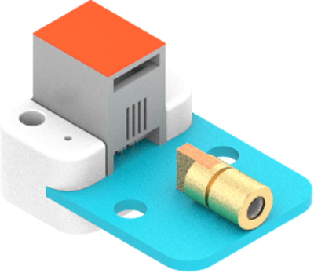
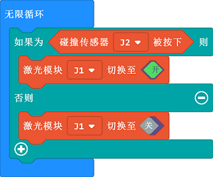

# Laser Module(EF05013)

## Introduction

It is made of a laser emission chip, condensing lens and an adjustable sleeve, which can work after powering on.



## Products Link

[ELECFREAKS PlanetX Laser](https://shop.elecfreaks.com/products/elecfreaks-planetx-laser?_pos=1&_sid=5e076bd88&_ss=r)

## Characteristic


 Designed in RJ11 connections, easy to plug.

## Specification


Item | Parameter 
:-: | :-: 
SKU|EF05013
Connection|RJ11
Type of Connection|Digital input
Working Voltage|3.3V
Spot Size|φ10mm ~ φ15mm at 15 meters away


## Outlook


## Quick to Start


### Materials Required and Diagram

 Connect the Laser module to J1 port and the Crash sensor to J2 port in the Nezha expansion board as the picture shows.


## MakeCode Programming


### Step 1

Click "Advanced" in the MakeCode drawer to see more choices.


We need to add a package for programming, . Click "Extensions" in the bottom of the drawer and search with "PlanetX" in the dialogue box to download it. 


***Note:*** If you met a tip indicating that the codebase will be deleted due to incompatibility, you may continue as the tips say or build a new project in the menu. 

### Step 2

### Code as below:




### Link
Link: [https://makecode.microbit.org/_9HfKVgiKeHqK](https://makecode.microbit.org/_9HfKVgiKeHqK)

You may also download it directly below: 

<div style="position:relative;height:0;padding-bottom:70%;overflow:hidden;"><iframe style="position:absolute;top:0;left:0;width:100%;height:100%;" src="https://makecode.microbit.org/#pub:_9HfKVgiKeHqK" frameborder="0" sandbox="allow-popups allow-forms allow-scripts allow-same-origin"></iframe></div>  


### Result
 The Laser module turns on while the crash switch being pressed or it turns off.

## Python Programming 


### Step 1

Download the package and unzip it: [PlanetX_MicroPython](https://github.com/lionyhw/PlanetX_MicroPython/archive/master.zip)

Go to   [Python editor](https://python.microbit.org/v/2.0)


We need to add enum.py and laser.py for programming. Click "Load/Save" and then click "Show Files (1)" to see more choices, click "Add file" to add enum.py and laser.py from the unzipped package of PlanetX_MicroPython. 


### Step 2

### Reference

```
from microbit import *
from enum import *
from laser import *
laser = LASER(J1)
while True:
    laser.set_laser(1)
    sleep(500)
    laser.set_laser(0)
    sleep(500)
```


### Result
 The Laser module lights on for 500ms and then lights off for 500ms after powering on. 

## Relevant File


## Technique File

