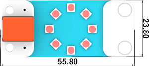
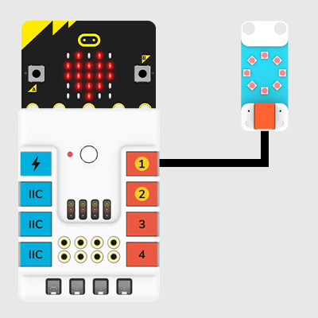
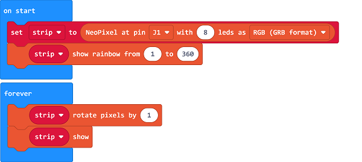

# Rainbow LED Ring(EF05015)

## Introduction 
---
Rainbow LED Ring is based on WS2812B bead that can show the RGB. 


## Characteristic
---

- Designed in RJ11 connections, easy to plug.

## Specification
---

Item | Parameter 
:-: | :-: 
SKU|EF05015
Connection|RJ11
Type of Connection|Digital input
Working Voltage|3.3V
Core IC|WS2812 3535 Encapsulation
Number of Pixels|8

## Outlook
---




## Quick to Start
---

### Materials Required and Diagram

- Connect the Rainbow LED ring to J1 port in the Nezha expansion board as the picture shows.




## MakeCode Programming
---

### Step 1

Click "Advanced" in the MakeCode drawer to see more choices.


We need to add a package for programming, . Click "Extensions" in the bottom of the drawer and search with "PlanetX" in the dialogue box to download it. 


***Note:*** If you met a tip indicating that the codebase will be deleted due to incompatibility, you may continue as the tips say or build a new project in the menu. 

### Step 2

### Code as below:




### Link
Link: [https://makecode.microbit.org/_AU7FyLCLFTMY](https://makecode.microbit.org/_AU7FyLCLFTMY)

You may also download it directly below: 

<div style="position:relative;height:0;padding-bottom:70%;overflow:hidden;"><iframe style="position:absolute;top:0;left:0;width:100%;height:100%;" src="https://makecode.microbit.org/#pub:_AU7FyLCLFTMY" frameborder="0" sandbox="allow-popups allow-forms allow-scripts allow-same-origin"></iframe></div>  


### Result
- Rainbow LED ring lights on. 

## Python Programming 
---

### Step 1

Download the package and unzip it: [PlanetX_MicroPython](https://github.com/lionyhw/PlanetX_MicroPython/archive/master.zip)

Go to   [Python editor](https://python.microbit.org/v/2.0)


### Step 2
### Reference
```
from microbit import *
import neopixel
from enum import *
from random import randint
np = neopixel.NeoPixel(J1, 8)
while True:
    for pixel_id in range(0, len(np)):
        red = randint(0, 60)
        green = randint(0, 60)
        blue = randint(0, 60)
        np[pixel_id] = (red, green, blue)
        np.show()
        sleep(100)
```


### Result
- Rainbow LED ring lights on after powering on. 

## Relevant File
---

## Technique File
---
