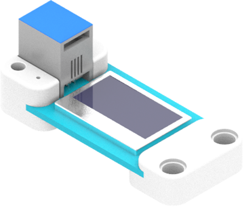
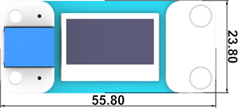
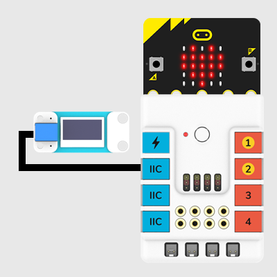
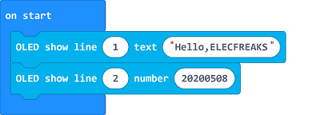
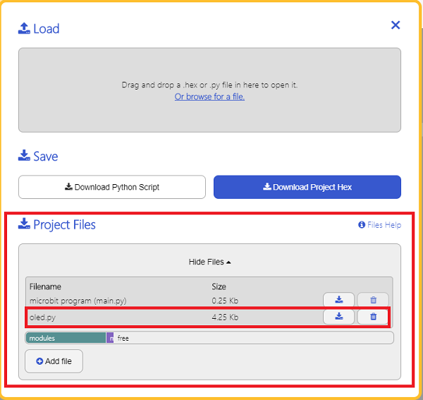

# OLED Display(EF05016)

## Introduction

It is an OLED display to show the data that you want to print. (Chinese is not supported)



## Products Link

[ELECFREAKS PlanetX OLED](https://shop.elecfreaks.com/products/elecfreaks-planetx-oled?_pos=1&_sid=c1b5ab563&_ss=r)

## Characteristic


 Designed in RJ11 connections, easy to plug.

## Specification


Item | Parameter 
:-: | :-: 
SKU|EF05016
Connection|RJ11
Type of Connection|IIC
Working Voltage|3.3V
Size|0.96
Resolution Ratio|128×64

## Outlook




## Quick to Start


### Materials Required and Diagram

 Connect the OLED module to IIC port in the Nezha expansion board as the picture shows.




## MakeCode Programming


### Step 1

Click "Advanced" in the MakeCode drawer to see more choices.


We need to add a package for programming, . Click "Extensions" in the bottom of the drawer and search with "PlanetX" in the dialogue box to download it. 


***Note:*** If you met a tip indicating that the codebase will be deleted due to incompatibility, you may continue as the tips say or build a new project in the menu. 

### Step 2

### Code as below:




### Link
Link: [https://makecode.microbit.org/_giYhpKcXTEVg](https://makecode.microbit.org/_giYhpKcXTEVg)

You may also download it directly below: 

<div style="position:relative;height:0;padding-bottom:70%;overflow:hidden;"><iframe style="position:absolute;top:0;left:0;width:100%;height:100%;" src="https://makecode.microbit.org/#pub:_giYhpKcXTEVg" frameborder="0" sandbox="allow-popups allow-forms allow-scripts allow-same-origin"></iframe></div>  


### Result
 The numbers set display on the OLED screen. 

## Python Programming 


### Step 1

Download the package and unzip it: [PlanetX_MicroPython](https://github.com/lionyhw/PlanetX_MicroPython/archive/master.zip)

Go to   [Python editor](https://python.microbit.org/v/2.0)


We need to add oled.py for programming. Click "Load/Save" and then click "Show Files (1)" to see more choices, click "Add file" to add oled.py from the unzipped package of PlanetX_MicroPython. 




### Step 2
### Reference
```
from microbit import *
from oled import *

display = OLED1306()
display.set_text(0, 0, "hello")
```


### Result
 The OLED screen displays "Hello" after powering on. 

## Relevant File


## Technique File

