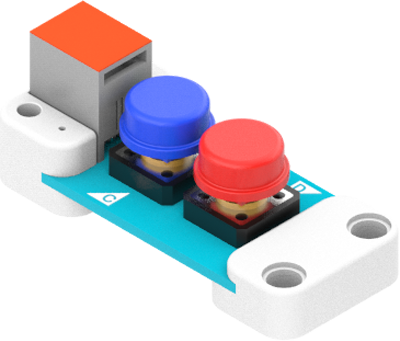
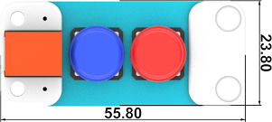
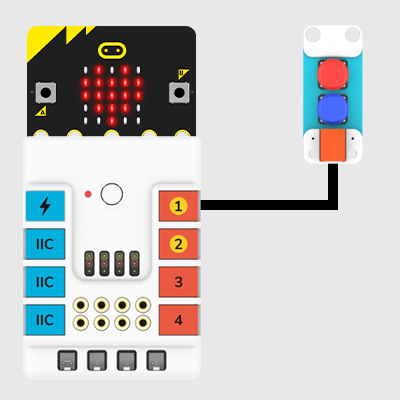
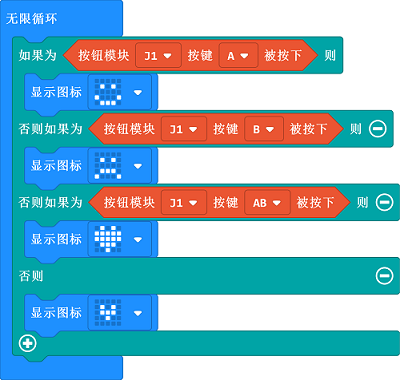
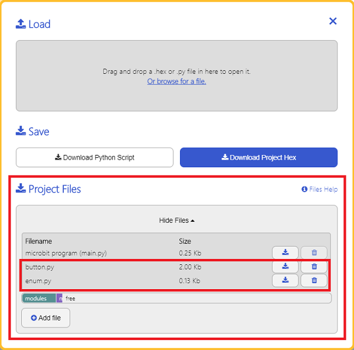

# Push Button Module(EF05017)

## Introduction


The Push button module is able to detect your press action.



## Products Link

[ELECFREAKS PlanetX Button Sensor](https://www.elecfreaks.com/planetx-button.html)

## Characteristic


 Designed in RJ11 connections, easy to plug.

## Specification


Item | Parameter 
:-: | :-: 
SKU|EF05017
Connection|RJ11
Connections type|Digit output
Power|3.3V


## Outlook




## Quick to Start


### Materials Required and Diagram

 Connect the Push-button module to J1 port in the Nezha expansion board as the picture shows.




## MakeCode Programming


### Step 1

Click "Advanced" in the MakeCode drawer to see more choices.


We need to add a package for programming, . Click "Extensions" in the bottom of the drawer and search with "PlanetX" in the dialogue box to download it. 


***Note:*** If you met a tip indicating that the codebase will be deleted due to incompatibility, you may continue as the tips say or build a new project in the menu. 

### Step 2

### Code as below:




### Link
Link: [https://makecode.microbit.org/_7bYWKYccY73R](https://makecode.microbit.org/_7bYWKYccY73R)

You may also download it directly below: 

<div style="position:relative;height:0;padding-bottom:70%;overflow:hidden;"><iframe style="position:absolute;top:0;left:0;width:100%;height:100%;" src="https://makecode.microbit.org/#pub:_7bYWKYccY73R" frameborder="0" sandbox="allow-popups allow-forms allow-scripts allow-same-origin"></iframe></div>  


### Result
 The icons display on the micro:bit accordingly with the order given by pressing button A or B or A+B. 

## Python Programming 


### Step 1

Download the package and unzip it: [PlanetX_MicroPython](https://github.com/lionyhw/PlanetX_MicroPython/archive/master.zip)

Go to   [Python editor](https://python.microbit.org/v/2.0)


We need to add enum.py and button.py for programming. Click "Load/Save" and then click "Show Files (1)" to see more choices, click "Add file" to add enum.py and button.py from the unzipped package of PlanetX_MicroPython. 




### Step 2

### Reference

```
from microbit import *
from enum import *
from button import *

button = BUTTON(J1)
while True:
    if button.A_is_pressed():
        display.show(Image.HAPPY)
    elif button.B_is_pressed():
        display.show(Image.SAD)
    elif button.AB_is_pressed():
        display.show(Image.COW)
        sleep(500)
```


### Result
 The icons display on the micro:bit accordingly with the order given by pressing button A or B or A+B.

## Relevant File


## Technique File

