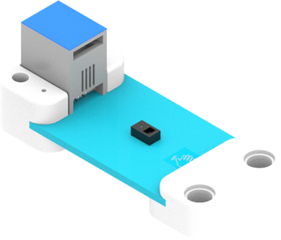
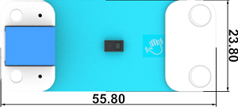
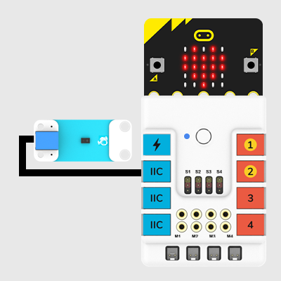
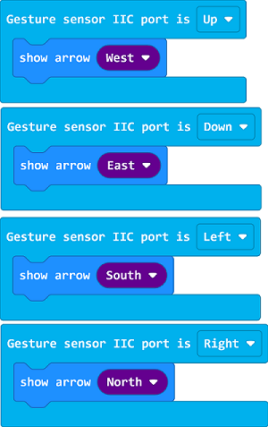

# Gesture Sensor

## Introduction
Gesture Sensor is able to recognize 9 gestures including move-up, move-down, move-left, move-right, etc. with a simple swipe of your hand, it is usually used in the non-contact controlling system such as the non-contact mouses, smart home, clicking equipments controlling in cars and interaction to robots ect.

## Characteristic

---

- Designed in RJ11 connections, easy to plug.

## Specification

---

Item | Parameter 
:-: | :-: 
SKU|EF05020
Connection|RJ11
Type of Connection|IIC
Working Voltage|3.3V
Core IC|PAJ7620U2
Supported Gestures|Basic gestures(Up, down, right, left, forward, reverse, clockwise, anticlockwise.)

## Outlook
---

## Quick to Start

---

### Materials Required and Diagram

---

- Connect the Gesture sensor to the IIC port in the Nezha expansion board as the picture shows.

## MakeCode Programming

---

### Step 1

Click "Advanced" in the MakeCode drawer to see more choices.

We need to add a package for programming, . Click "Extensions" in the bottom of the drawer and search with "PlanetX" in the dialogue box to download it. 

Note: If you met a tip indicating that the codebase will be deleted due to incompatibility, you may continue as the tips say or build a new project in the menu. 

### Step 2

### Code as below:

### Link
Link: [https://makecode.microbit.org/_gqVLAwesWAcU](https://makecode.microbit.org/_gqVLAwesWAcU)

You may also download it directly below: 

<iframe style="position:absolute;top:0;left:0;width:100%;height:100%;" src="https://makecode.microbit.org/#pub:_gqVLAwesWAcU" frameborder="0" sandbox="allow-popups allow-forms allow-scripts allow-same-origin"></iframe>
  
---

### Result
- The equivalent icon for each gesture displays on the micro:bit. 
## Relevant File

---

## Technique File

---
