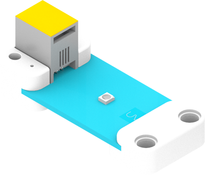
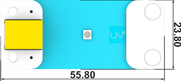
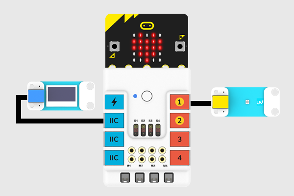
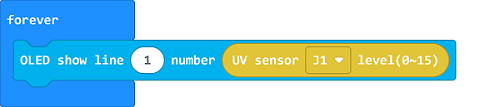
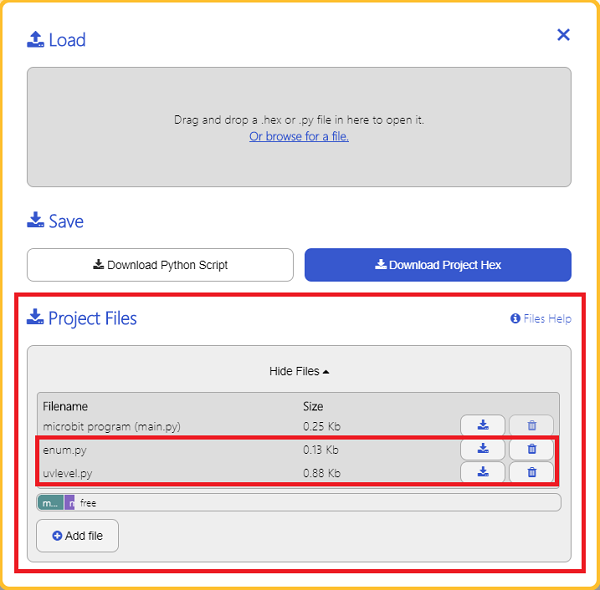

# UV Sensor(EF05021)

## Introduction
---
It is able to measure the total UV intensity of the sunlight.



## Characteristic
---

- Designed in RJ11 connections, easy to plug.

## Specification
---

Item | Parameter 
:-: | :-: 
SKU|EF05021
Connection|RJ11
Type of Connection|Analog output
Working Voltage|3.3V


## Outlook
---





## Quick to Start
---

### Materials Required and Diagram

- Connect the UV sensor to J1 port and the OLED to the IIC port in the Nezha expansion board as the picture shows.




## MakeCode Programming
---

### Step 1

Click "Advanced" in the MakeCode drawer to see more choices.


We need to add a package for programming, . Click "Extensions" in the bottom of the drawer and search with "PlanetX" in the dialogue box to download it. 


***Note:*** If you met a tip indicating that the codebase will be deleted due to incompatibility, you may continue as the tips say or build a new project in the menu. 

### Step 2

### Code as below:




### Link
Link: [https://makecode.microbit.org/_LLyW1FH0hC8D](https://makecode.microbit.org/_LLyW1FH0hC8D)

You may also download it directly below: 

<div style="position:relative;height:0;padding-bottom:70%;overflow:hidden;"><iframe style="position:absolute;top:0;left:0;width:100%;height:100%;" src="https://makecode.microbit.org/#pub:_LLyW1FH0hC8D" frameborder="0" sandbox="allow-popups allow-forms allow-scripts allow-same-origin"></iframe></div>  


### Result
- The detected value from the UV sensor displays on the OLED screen. 

## Python Programming 
---

### Step 1

Download the package and unzip it: [PlanetX_MicroPython](https://github.com/lionyhw/PlanetX_MicroPython/archive/master.zip)

Go to  [Python editor](https://python.microbit.org/v/2.0)


We need to add enum.py and uvlevel.py for programming. Click "Load/Save" and then click "Show Files (1)" to see more choices, click "Add file" to add enum.py and uvlevel.py from the unzipped package of PlanetX_MicroPython. 




### Step 2

### Reference

```
from microbit import *
from enum import *
from uvlevel import *
uvlevel = UVLEVEL(J1)
while True:
    display.scroll(int(uvlevel.get_uvlevel()))
```


### Result
- The detected value from the UV sensor displays on the micro:bit. 

## Relevant File
---

## Technique File
---
