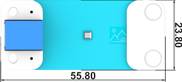
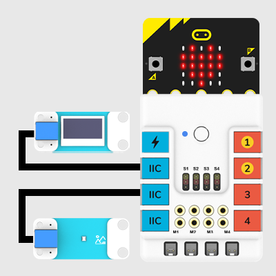
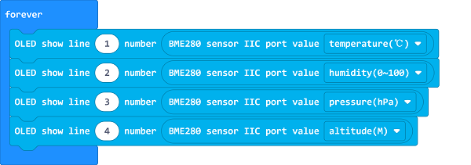

# BME280 Air Pressure Sensor(EF05022)

## Introduction
---
BME280 Pressure Sensor is an electric brick integrating temperature sensor, air pressure sensor and humidity sensor onboard. We can use it to calculate the altitude according to the measured air pressure.

## Characteristic
---

- Designed in RJ11 connections, easy to plug.

## Specification
---

Item | Parameter 
:-: | :-: 
SKU|EF05022
Connection|RJ11
Type of Connection|IIC
Working Voltage|3.3V
Core IC|BME280

## Outlook
---

## Quick to Start
---

### Materials Required and Diagram

- Connect the BME280 air pressure sensor to the IIC port and the OLED to the other IIC port in the Nezha expansion board as the picture shows.

## MakeCode Programming
---

### Step 1

Click "Advanced" in the MakeCode drawer to see more choices.

We need to add a package for programming, . Click "Extensions" in the bottom of the drawer and search with "PlanetX" in the dialogue box to download it. 

***Note:*** If you met a tip indicating that the codebase will be deleted due to incompatibility, you may continue as the tips say or build a new project in the menu. 

### Step 2

### Code as below:

### Link
Link: [https://makecode.microbit.org/_PXW5kc68kUyq](https://makecode.microbit.org/_PXW5kc68kUyq)

You may also download it directly below: 

<iframe style="position:absolute;top:0;left:0;width:100%;height:100%;" src="https://makecode.microbit.org/#pub:_PXW5kc68kUyq" frameborder="0" sandbox="allow-popups allow-forms allow-scripts allow-same-origin"></iframe>
  

### Result
- The values of the temperature, moisture, air pressure and the altitude in the current environment display on the OLED screen. 

## Relevant File
---

## Technique File
---
