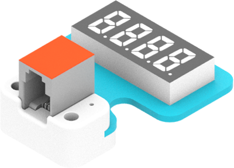
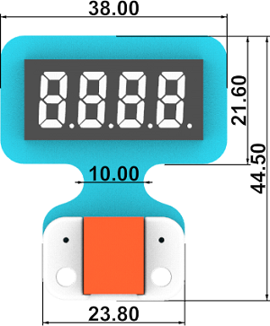
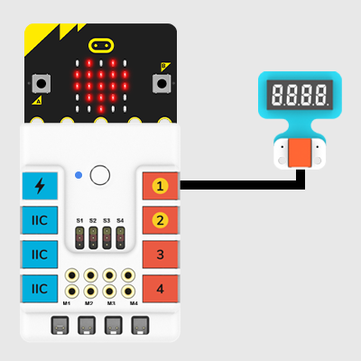
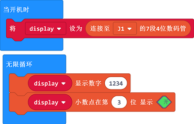
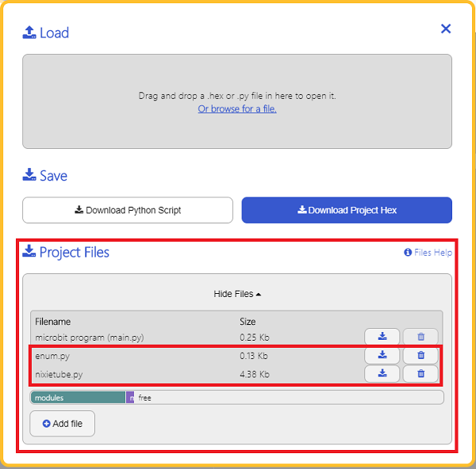

# 7-Seg LED Nixietube

##  Introduction
It is able to display the numbers and time and so on. 



## Characteristic

---

- Designed in RJ11 connections, easy to plug.

## Specification

---

Item | Parameter 
:-: | :-: 
SKU|EF05026
Connection|RJ11
Type of Connection|Digital input
Working Voltage|3.3V
Core IC|TM1637


## Outlook
---




## Quick to Start

---

### Materials Required and Diagram

---

- Connect the 7-Seg LED Nixietube to J1 port in the Nezha expansion board as the picture shows.




## MakeCode Programming

---

### Step 1

Click "Advanced" in the MakeCode drawer to see more choices.


We need to add a package for programming, . Click "Extensions" in the bottom of the drawer and search with "PlanetX" in the dialogue box to download it. 


Note: If you met a tip indicating that the codebase will be deleted due to incompatibility, you may continue as the tips say or build a new project in the menu. 

### Step 2

### Code as below:




### Link
Link: [https://makecode.microbit.org/_7tmRmJ2c4Khw](https://makecode.microbit.org/_7tmRmJ2c4Khw)

You may also download it directly below:

<div style="position:relative;height:0;padding-bottom:70%;overflow:hidden;"><iframe style="position:absolute;top:0;left:0;width:100%;height:100%;" src="https://makecode.microbit.org/#pub:_7tmRmJ2c4Khw" frameborder="0" sandbox="allow-popups allow-forms allow-scripts allow-same-origin"></iframe></div>  
---

### Result
- Set it display 12.34.

## Python Programming 

---

### Step 1

Download the package and unzip it: [PlanetX_MicroPython](https://github.com/lionyhw/PlanetX_MicroPython/archive/master.zip)

Go to  [Python editor](https://python.microbit.org/v/2.0)


We need to add enum.py and nixietube.py for programming. Click "Load/Save" and then click "Show Files (1)" to see more choices, click "Add file" to add enum.py and nixietube.py from the unzipped package of PlanetX_MicroPython. 




### Step 2

### Reference

```
from microbit import *
from enum import *
from nixietube import *

tm = NIXIETUBE(J1)
n = 0
while n < 10000:
    tm.set_show_num(n)
    n += 1
```


### Result
- The numbers from 0~99999 display on the 7-Seg LED Nixietube.
## Relevant File

---

## Technique File

---
