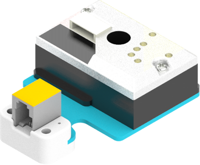
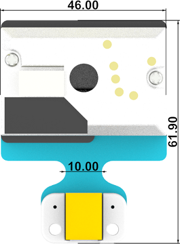
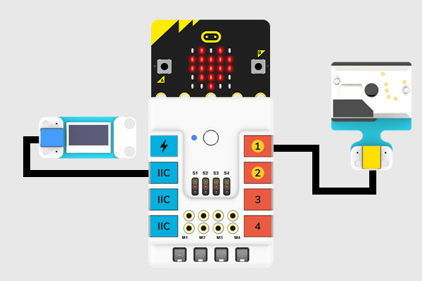
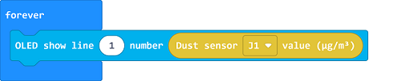
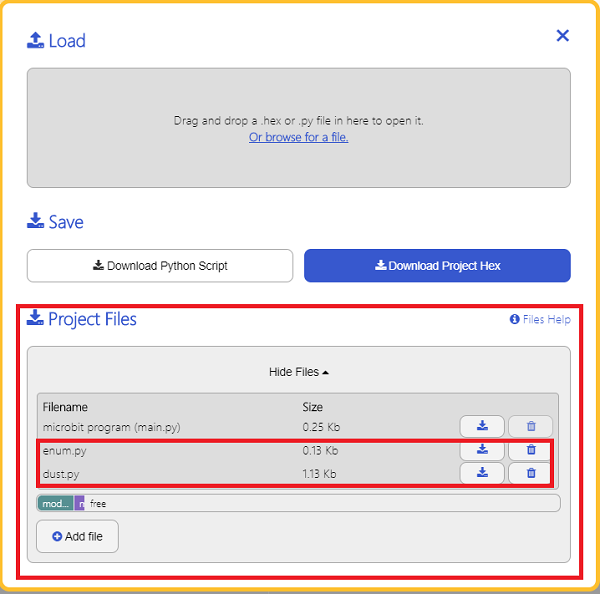

# Dust Sensor Detector Module(EF05027)

## Introduction
---
The Dust Sensor Detector Module with Sharp GP2Y1010AU0F adopts Sharp optical dust sensor(GP2Y1010AU0F). It is used to detect the density of dust particle with diameter beyond 0.8μm such as cigarette smoke.



## Characteristic
---

- Designed in RJ11 connections, easy to plug.

## Specification
---

Item | Parameter 
:-: | :-: 
SKU|EF05027
Connection|RJ11
Type of Connection|Digital output
Working Voltage|3.3V
Sensitivity|0.5V /（100μg/ m3）
Effective Scope|500μg/ m3


## Outlook
---




## Quick to Start
---

### Materials Required and Diagram

- Connect the Dust sensor to J1 port and the OLED to the IIC port in the Nezha expansion board as the picture shows.




## MakeCode Programming
---

### Step 1

Click "Advanced" in the MakeCode drawer to see more choices.


We need to add a package for programming, . Click "Extensions" in the bottom of the drawer and search with "PlanetX" in the dialogue box to download it. 


***Note:*** If you met a tip indicating that the codebase will be deleted due to incompatibility, you may continue as the tips say or build a new project in the menu. 

### Step 2

### Code as below:




### Link
Link: [https://makecode.microbit.org/_WupJoaVVEdUL](https://makecode.microbit.org/_WupJoaVVEdUL)

You can also download it directly below:

<div style="position:relative;height:0;padding-bottom:70%;overflow:hidden;"><iframe style="position:absolute;top:0;left:0;width:100%;height:100%;" src="https://makecode.microbit.org/#pub:_WupJoaVVEdUL" frameborder="0" sandbox="allow-popups allow-forms allow-scripts allow-same-origin"></iframe></div>  


### Result
- The value detected by the Dust Sensor displays on the OLED screen.

## Python Programming 
---

### Step 1

Download the package and unzip it: [PlanetX_MicroPython](https://github.com/lionyhw/PlanetX_MicroPython/archive/master.zip)

Go to  [Python editor](https://python.microbit.org/v/2.0)


We need to add enum.py and dust.py for programming. Click "Load/Save" and then click "Show Files (1)" to see more choices, click "Add file" to add enum.py and dust.py from the unzipped package of PlanetX_MicroPython. 




### Step 2

### Reference

```
from microbit import *
from enum import *
from dust import *

dis = DUST(J1)
while True:
    display.scroll(dis.get_dust())
    sleep(500)
```


### Result
- The value detected by the Dust Sensor displays on the micro:bit.

## Relevant File
---

## Technique File
---
