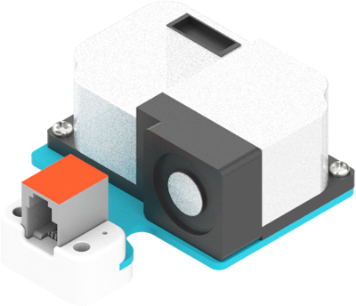
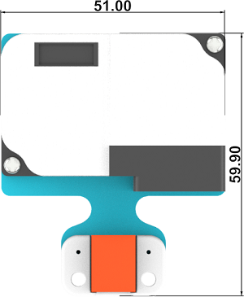
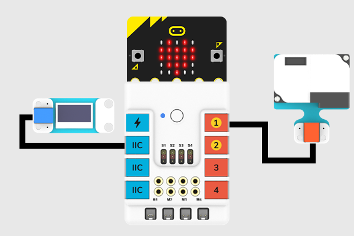
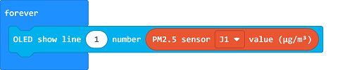
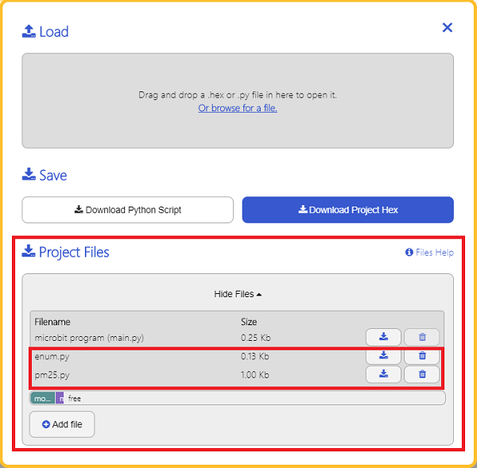

# PM2.5 Module(EF05028)

## Introduction

PM2.5 module is able to test the PM2.5 concentration in the current environment. Based on ZH03 laser dust sensors, it is able to test the dust particle in the air. 



## Products Link

[ELECFREAKS PlanetX PM2.5 Sensor](https://shop.elecfreaks.com/products/elecfreaks-planetx-pm2-5-sensor?_pos=1&_sid=58cf47364&_ss=r)

## Characteristic


 Designed in RJ11 connections, easy to plug.

## Specification


Item | Parameter 
:-: | :-: 
SKU|EF05028
Connection|RJ11
Type of Connection|Digital output
Working Voltage|3.3V


## Outlook




## Quick to Start


### Materials Required and Diagram

 Connect the PM2.5 sensor to J1 port and the OLED to the IIC port in the Nezha expansion board as the picture shows.




## MakeCode Programming


### Step 1

Click "Advanced" in the MakeCode drawer to see more choices.


We need to add a package for programming, . Click "Extensions" in the bottom of the drawer and search with "PlanetX" in the dialogue box to download it. 


***Note:*** If you met a tip indicating that the codebase will be deleted due to incompatibility, you may continue as the tips say or build a new project in the menu. 

### Step 2

### Code as below:




### Link
Link: [https://makecode.microbit.org/_Mvxdh2ER4JdF](https://makecode.microbit.org/_Mvxdh2ER4JdF)

You may also download it directly below:

<div style="position:relative;height:0;padding-bottom:70%;overflow:hidden;"><iframe style="position:absolute;top:0;left:0;width:100%;height:100%;" src="https://makecode.microbit.org/#pub:_Mvxdh2ER4JdF" frameborder="0" sandbox="allow-popups allow-forms allow-scripts allow-same-origin"></iframe></div>  


### Result
 The value detected from the PM2.5 module display on the OLED screen.

## Python Programming 


### Step 1

Download the package and unzip it: [PlanetX_MicroPython](https://github.com/lionyhw/PlanetX_MicroPython/archive/master.zip)

Go to  [Python editor](https://python.microbit.org/v/2.0)


We need to add enum.py and PM25.py for programming. Click "Load/Save" and then click "Show Files (1)" to see more choices, click "Add file" to add enum.py and PM25.py from the unzipped package of PlanetX_MicroPython. 




### Step 2

### Reference

```
from microbit import *
from enum import *
from pm25 import *

pm2_5 = PM25(J1)
while True:
    print(pm2_5.get_pm25())
    sleep(1000)

```


### Result
 The value detected from the PM2.5 module display on the micro:bit.

## Relevant File


## Technique File

