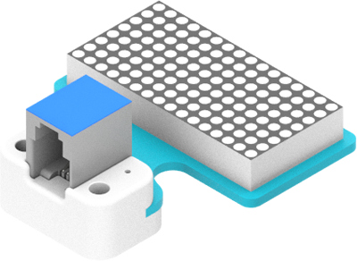
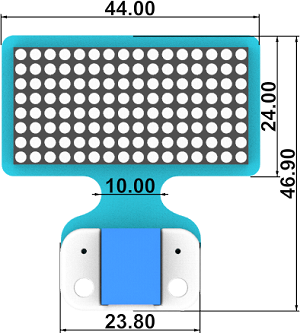
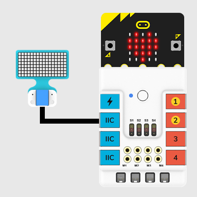
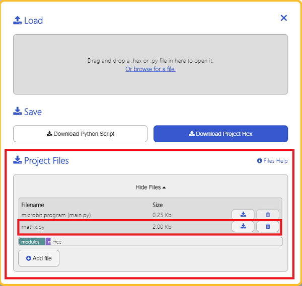

# 8x16 Matrix Module(EF05029)

## Introduction

8 x 16 Matrix module is a kind of 8 x 16 matrix screen that can display numbers, commonly used letters and symbols with scrolling-displaying function.




## Products Link

[ELECFREAKS PlanetX 8x16 Matrix Sensor](https://www.elecfreaks.com/planetx-8x16-matrix.html)

## Characteristic


 Designed in RJ11 connections, easy to plug.

## Specification


Item | Parameter 
:-: | :-: 
SKU|EF05029
Connection|RJ11
Type of Connection|IIC
Working Voltage|3.3V


## Outlook




## Quick to Start


### Materials Required and Diagram

 Connect the 8x16 Matrix module to the IIC port in the Nezha expansion board as the picture shows.




## MakeCode Programming


### Step 1

Click "Advanced" in the MakeCode drawer to see more choices.


We need to add a package for programming, . Click "Extensions" in the bottom of the drawer and search with "PlanetX" in the dialogue box to download it. 


***Note:*** If you met a tip indicating that the codebase will be deleted due to incompatibility, you may continue as the tips say or build a new project in the menu. 

### Step 2

### Code as below:


### Link
Link: [https://makecode.microbit.org/_H1Dec3A9iDDM](https://makecode.microbit.org/_H1Dec3A9iDDM)

You may also download it directly below: 

<div style="position:relative;height:0;padding-bottom:70%;overflow:hidden;"><iframe style="position:absolute;top:0;left:0;width:100%;height:100%;" src="https://makecode.microbit.org/#pub:_H1Dec3A9iDDM" frameborder="0" sandbox="allow-popups allow-forms allow-scripts allow-same-origin"></iframe></div>  


### Result
 The expresssions display on the 8x16 matrix module. 

## Python Programming 


### Step 1

Download the package and unzip it: [PlanetX_MicroPython](https://github.com/lionyhw/PlanetX_MicroPython/archive/master.zip)

Go to  [Python editor](https://python.microbit.org/v/2.0)


We need to add matrix.py for programming. Click "Load/Save" and then click "Show Files (1)" to see more choices, click "Add file" to add matrix.py from the unzipped package of PlanetX_MicroPython. 




### Step 2

### Reference

```
from microbit import *
from matrix import *
matrix = MATRIX()
x, y = 0, 0
while True:
    for y in range(8):
        for x in range(16):
            matrix.set_matrix_draw(x, y)
    matrix.set_matrix_clear()
```


### Result
 Each LED lights on from the sequence of left to right and up to down, then they light off after all the LEDs light up. 

## Relevant File


## Technique File

